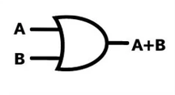
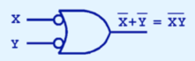
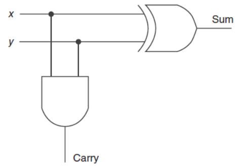
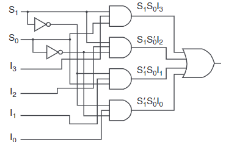
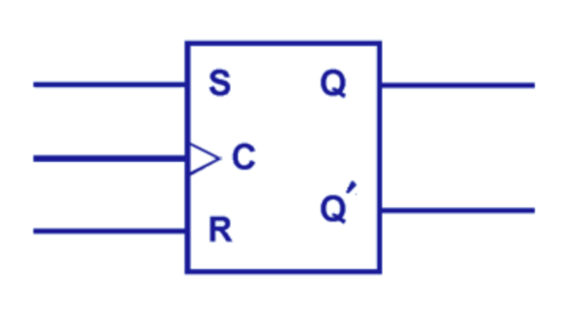
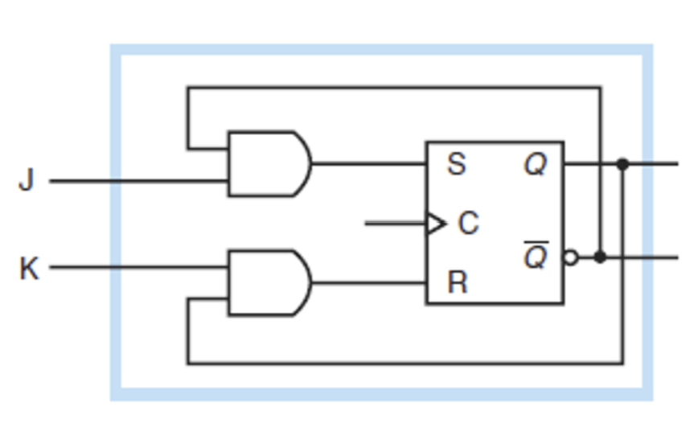
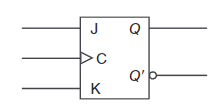

# CDA 3103 Computer Organization & Architecture - Exam 2 Review

<!-- Use 'img' tags when image resizing is needed. -->
<!-- Use 'table' tag to display images side-by-side. -->
<!-- GitHub renders instructions & circuit images in tables with proper alignment/width. -->

<p style="text-align:center">
    <a href="../cda3103_textbook.pdf">textbook</a> |
    <a href="https://www.youtube.com/playlist?list=PLjrUT4yHnh3JxMGJmUCBEZklpVlTJZS94">recitations</a> |
    <a href="../flashcards/cda3103_exam2_flashcards.csv">flashcards</a> |
    <a href="https://quizlet.com/845007313/cda-3103-exam-2-risc-v-logic-gate-circuits-flash-cards">quizlet</a>

</p>

## 1. Logic Gates & Combinational Circuits

- Presence of electricity in some part of a circuit is a *signal*
    - Represents `1`
    - Absence represents `0`
- Boolean expressions can be represented as a diagram of *logic gates*
    - Composed of transistors
    - All except NOT can accept any number of input (incoming) signals
- All other gates can be created from NAND and NOR gates
    - "Universal gates", more commonly NAND

<!-- Images in the following tables are not perfectly aligned--leave as-is. -->

#### **Figure 1.** Common Logic Gates
| Name  | Symbol                                        | Requisite for Signal Output   | Boolean Equivalent            | Simplified Form   | NAND Form     |
|:------|:----------------------------------------------|:------------------------------|:------------------------------|:------------------|:--------------|
| NOT   |     | No input signal               | x', $\bar{x}$                 |                   | (xx)'         |
| AND   |     | All input signals             | xy                            |                   | ((xy)'(xy)')' |
| OR    |      | Any input signal              | x + y                         |                   | ((xx)'(yy)')' |
| XOR   |     | Exactly one input signal      | x $\oplus$ y                  | x'y + xy'         |               |
| NAND  |    | Absence of any input signal   | (xy)'                         | x' + y'           |               |
| NOR   |     | No input signals              | (x + y)'                      | x'y'              |               |
| XNOR  |    | Equal input signals           | (x $\oplus$ y)'               | x'y' + xy         |               |

#### **Figures 2-3.** Alternate forms of NAND and NOR
<p style="text-align:center; display:flex; gap:5%; justify-content: center;">
    <br>
    
</p>

- *Half-adder* adds two bits, providing the result and carry

#### **Figure 4.** Half-Adder Circuit Diagram
<p style="text-align:center">
    
</p>

#### **Figure 5.** Bitwise Adder Conditions
| Number of `1`s    | Sum   | Carry |
|:-----------------:|:-----:|:-----:|
| 0                 | 0     | 0     |
| 1                 | 1     | 0     |
| 2                 | 0     | 1     |
| 3                 | 1     | 1     |

#### **Figure 6.** Half-Adder Truth Table
| x | y | Sum   | Carry |
|:-:|:-:|:-----:|:-----:|
| 0 | 0 | 0     | 0     |
| 0 | 1 | 1     | 0     |
| 1 | 0 | 1     | 0     |
| 1 | 1 | 0     | 1     |

- Full-adder extends half-adder to add binary numbers larger than 1 bit

#### **Figure 7.** Full-Adder Circuit Diagram
<p style="text-align:center">
    
</p>

#### **Figure 8.** Full-Adder Truth Table
| x | y | Carry In  | Sum   | Carry out |
|:-:|:-:|:---------:|:-----:|:---------:|
| 0 | 0 | 0         | 0     | 0         |
| 0 | 0 | 1         | 1     | 0         |
| 0 | 1 | 0         | 1     | 0         |
| 0 | 1 | 1         | 0     | 1         |
| 1 | 0 | 0         | 1     | 0         |
| 1 | 0 | 1         | 0     | 1         |
| 1 | 1 | 0         | 0     | 1         |
| 1 | 1 | 1         | 1     | 1         |

#### **Figure 9.** Common Combinational Circuits
| Name          | Block Diagram                                                 | Circuit Diagram                                           | Purpose                                                                                                               | Boolean Equivalent                            |
|:--------------|:--------------------------------------------------------------|:----------------------------------------------------------|:----------------------------------------------------------------------------------------------------------------------|:----------------------------------------------|
| Multiplexer   |       |         | Chooses one input among $2^n$ inputs ($I_0\dots I_{2^n-1}$), according to *n* selection inputs ($S_0,S_1,\dots S_n$)  | $S_1S_0I_3+S_1S_0'I_2+S_1'S_0I_1+S_1'S_0'I_0$ |
| Decoder       |   |     | Converts *n* inputs ($x,y,\dots$) to $2^n$ outputs                                                                    | $xy,xy',x'y,x'y'$                             |

- Multiplexers and decoders described by their inputs/outputs
    - **Ex:** 4-to-1 multiplexer (4 inputs/1 output)

## 4. Sequential Circuits

### ***i.* Introduction**

- Hold and use data, typically 1 bit, from previous input(s) to produce next output(s)
    - For each type, either synchronous or asynchronous
- *Synchronous* circuits respond to initial & past inputs only when clock is in specific state
    - Most sequential circuits
- *Asynchronous* circuits respond to inputs all the time (do not have a clock)
- Signal output given previous & current inputs shown by *characteristic table*
    - Similar to a truth table
- When evaluating sequential circuits, output dependent on feedback is its previous output

// TODO CHARACTERISTIC TABLE EXAMPLE (1)

### ***ii.* SR Latch**

- Holds one bit of data, *Q*
    - Complement is secondary output, $\bar{Q}$
- Asynchronous

#### **Figure 10.** SR Latch Circuit Diagram
<p style="text-align:center">
      
</p>

### ***iii.* SR Flip-Flop ([interactive](https://circuitverse.org/users/269149/projects/sr-flip-flop-0b7a0de1-fe11-40df-9094-3a27b6963370))**

- Extends SR latch
    - Clock controls speed at which output is updated to next value

#### **Figure 11.** SR Flip-Flop Circuit Diagram
<p style="text-align:center">
    
</p>

#### **Figure 12.** SR Flip-Flop Block Diagram
<p style="text-align:center">
    
</p>

#### **Figure 13.** SR Flip-Flop Characteristic Table
| S (Set)   | R (Reset) | Q(t + 1)                      |
|:---------:|:---------:|:-----------------------------:|
| 0         | 0         | Q(t)                          |
| 0         | 1         | 0                             |
| 1         | 0         | 1                             |
| 1         | 1         | <small>*undefined*</small>    |

### ***iv.* D Flip-Flop ([interactive](https://circuitverse.org/users/269149/projects/d-flip-flop-40d49df4-0896-410a-bbd5-16acdd8883ae))**

- Modified SR flip-flop where only "set" input is needed
    - "Reset" input is always complement of "set"
- Information stored in flip-flop changes only as input changes
- Clock pulses update output, but do not change it

#### **Figure 14.** D Flip-Flop Circuit Diagram
<p style="text-align:center">
    

#### **Figure 15.** D Flip-Flop Block Diagram
<p style="text-align:center">
    
</p>

#### **Figure 16.** D Flip-Flop Characteristic Table
| D (Data)  | Q(t + 1)  |
|:---------:|:---------:|
| 0         | 0         |
| 1         | 1         |

### ***v.* JK Flip-Flop ([interactive](https://circuitverse.org/users/269149/projects/jk-flip-flop-5d11e97f-e706-45b7-9dd6-fba45eb3f167))**

- Modified SR flip-flop where both inputs can be `1`
- "Set" denoted by J, "reset" denoted by K.

#### **Figure 17.** Circuit Diagram
<p style="text-align:center">
    
</p>

#### **Figure 18.** Block Diagram
<p style="text-align:center">
    
</p>

#### **Figure 19.** Characteristic Table
| J (Set)   | K (Reset) | Q(t + 1)  |
|:---------:|:---------:|:---------:|
| 0         | 0         | Q(t)      |
| 0         | 1         | 0         |
| 1         | 0         | 1         |
| 1         | 1         | Q(t)'     |

## 5. Introduction to RISC-V Assembly

- *RISC-V* is a free and open-source instruction set architecture (ISA)
    - [Specification](https://riscv.org/wp-content/uploads/2017/05/riscv-spec-v2.2.pdf)
    - We will use RV32I, a dialect of RISC-V
- Relies heavily on comments, denoted by `#`, to derive meaning from code
- Recall registers are a small, extremely fast units of memory
    - Store 32-bit values
    - 32 in total
- Memory addresses are 4 bytes (1 word)
- Instructions operate on values in registers
    - Follows the form `inst rs, ra1, ...`
        - Instruction ID, register store, register arguments...
        - Location to store result must be made explicit
    - Are case-insensitive

#### **Figure 20.** RV32I Registers
| Register      | Mnemonic/Alliance | Description                       | Use-case                                                          | Saver     |
|:-------------:|:-----------------:|:----------------------------------|:------------------------------------------------------------------|:----------|
| `x0`          | `zero`            | Hard-wired zero                   | Immediate constant `0`                                            |           |
| `x1`          | `ra`              | Return address                    | Function to return to when current function terminates            | Caller    |
| `x2`          | `sp`              | Stack pointer                     | Allocating stack memory for local variables & return addresses    | Callee    |
| `x3`          | `gp`              | Global pointer                    | <small>*we will not use this*</small>                             |           |
| `x4`          | `tp`              | Thread pointer                    | <small>*we will not use this*</small>                             |           |
| `x5`-`x7`     | `t0`-`t2`         | Temporaries                       | Local variables when not in another function                      | Caller    |
| `x8`          | `s0`/`fp`         | Saved register/frame pointer      | Storing temporaries between function calls                        | Callee    |
| `x9`          | `s1`              | Saved register                    | Storing temporaries between function calls                        | Callee    |
| `x10`-`x11`   | `a0`-`a1`         | Function arguments/return values  | Function arguments or return values                               | Caller    |
| `x12`-`x17`   | `a2`-`a7`         | Function arguments                | Function arguments                                                | Caller    |
| `x18`-`x27`   | `s2`-`s11`        | Saved registers                   | Storing temporaries between function calls                        | Callee    |
| `x28`-`x31`   | `t3`-`t6`         | Temporaries                       | Local variables before other function calls                       | Caller    |

- Caller-saved registers are preserved by callers so that the callee can potentially modify them
- Callee-saved registers are restored by callees on their return so that the caller can treat them as if they had never changed
    - Especially important for saved, `s`, registers

## 6. The RISC-V Instruction Set

### ***i.* R-Type Instructions - ALU Register-to-Register**

- Arithmetic, logical, and shift operations using values stored in registers
- Bitwise operations AND, OR, and XOR apply the boolean operation to every bit in the operands
    - Analogous to `&`, `|`, and `^` operators in C

>**Example 2.** Evaluate $10100110_2$ *AND* $01110111_2$.
>
>```
>10100110
>01110111
>--------
>00100110
>```
>
>$\checkmark$

#### **Figure 21.** R-Type Instructions
| Instruction Form      | Description                                                                                                               |
|:----------------------|:--------------------------------------------------------------------------------------------------------------------------|
| `add  rd, rs1, rs2`   | Adds `rs1` and `rs2`, storing the result in `rd`                                                                          |
| `sub  rd, rs1, rs2`   | Subtracts `rs1` from `rs2`, storing the result in `rd`                                                                    |
| `slt  rd, rs1, rs2`   | If `rs1` < `rs2`, 1 is stored in `rd`, or 0 otherwise<br>*Treats the operands as signed*                                  |
| `sltu rd, rs1, rs2`   | If `rs1` < `rs2`, 1 is stored in `rd`, or 0 otherwise<br>*Treats the operands as unsigned*                                |
| `and  rd, rs1, rs2`   | Bitwise AND on `rs1` and `rs2`, storing the result in `rd`                                                                |
| `or   rd, rs1, rs2`   | Bitwise OR on `rs1` and `rs2`, storing the result in `rd`                                                                 |
| `xor  rd, rs1, rs2`   | Bitwise XOR on `rs1` and `rs2`, storing the result in `rd`                                                                |
| `sll  rd, rs1, rs2`   | Logical left shift on `rs1`<br>*Shift amount is 5 LSB of `rs2`<br>Inserts zeros where previous LSB were*                  |
| `srl  rd, rs1, rs2`   | Logical right shift on `rs1`<br>*Shift amount is 5 LSB of `rs2`<br>Inserts zeros where previous MSB were*                 |
| `sra  rd, rs1, rs2`   | Arithmetic right shift on `rs1`<br>*Shift amount is 5 LSB of `rs2`<br>Inserts previous sign bit where previous MSB were*  |

### ***ii.* I-Type Instructions - ALU Immediate-to-Register & Loading**

- I-type instruction use-cases
    - Arithmetic, logical, and shift operations using immediates (constants)
    - Reading from memory
- `Imm` is 12-bit integer within range [-2048, 2047]

#### **Figure 22.** I-Type Instructions
| Instruction Form      | Description                                                                                   |
|:----------------------|:----------------------------------------------------------------------------------------------|
| `addi rd, rs1, Imm`   | Adds `rs1` and `Imm`, storing the result in `rd`<br>*No `subi`, as `Imm` can be negative*     |
| `slti rd, rs1, Imm`   | If `rs1` < `Imm`, 1 is stored in `rd`, or 0 otherwise<br>*Treats the operands as signed*      |
| `sltiu rd, rs1, Imm`  | If `rs1` < `Imm`, 1 is stored in `rd`, or 0 otherwise<br>*Treats the operands as unsigned*    |
| `andi rd, rs1, Imm`   | Bitwise AND on `rs1` and `Imm`, storing the result in `rd`                                    |
| `ori rd, rs1, Imm`    | Bitwise OR on `rs1` and `rs2`, storing the result in `rd`                                     |
| `xori rd, rs2, Imm`   | Bitwise XOR on `rs1` and `rs2`, storing the result in `rd`                                    |
| `slli rd, rs1, Imm`   | Logical left shift on `rs1`<br>*Inserts zeros where previous LSB were*                        |
| `srli rd, rs1, Imm`   | Logical right shift in `rs1`<br>*Inserts zeros where previous MSB were*                       |
| `srai rd, rs1, Imm`   | Arithmetic right shift on `rs1`<br>*Inserts previous sign bit where previous MSB were*        |
| `lb rd, Imm(rs1)`     | Loads lowest byte (8 bits) from address `rs1 + Imm`, with sign extension                      |
| `lh rd, Imm(rs1)`     | Loads lowest 2 bytes (16 bits) from address `rs1 + Imm`, with sign extension                  |
| `lw rd, Imm(rs1)`     | Loads 4 bytes (32 bits) from address `rs1 + Imm`                                              |
| `lbu rd, Imm(rs1)`    | Loads lowest byte (8 bits) from address `rs1 + Imm`, with MSB filled with zeros               |
| `lhu rd, Imm(rs1)`    | Loads lowest 2 bytes (16 bits) from address `rs1 + Imm`, with MSB filled with zeros           |

#### **Figure 23.** I-Type Instruction Use Cases
| Instruction   | Use-Case                                                                                | Example                                               |
|:--------------|:----------------------------------------------------------------------------------------|:------------------------------------------------------|
| `andi`        | Clear specific bits, since `0x = 0`<br>Find modulo by *n*, where *n* is a power of 2    | `x % n` $\leftrightarrow$ `andi rd, {&x}, {n - 1}`    |
| `ori`         | Set specific bits, since `x + 1 = 1`                                                    |                                                       |
| `xori`        | Logical NOT                                                                             | `!x` $\leftrightarrow$ `xori rd, {&x}, -1`            |
| `slli`        | Multiply by $2^n$, where *n* is the shift amount                                        | `x * 4` $\leftrightarrow$ `slli rd, {&x}, 2`          |
| `srai`        | Divide by $2^n$, where *n* is the shift amount                                          | `x / 2` $\leftrightarrow$ `srai rd, {&x}, 1`          |
| `l{...}`      | Read value from an array                                                                | `x = (int) y[6]` $\leftrightarrow$ `lw {&x}, 6({&y})` |

- For instructions with an offset of `0`, the offset can be omitted
- For `slli`, if the constant is not a power of 2, sum multiple left shifts

>**Example 3.** Convert the following C code to RISC-V.
>```c
>j = h * 6          // j in t3, h in t0f
>```
>
>```assembly
>slli t1, t0, 1     # t1 = t0 * 2
>slli t2, t0, 2     # t2 = t0 * 4
>add t3, t1, t2     # t3 = t1 + t2 = 6 * t0
>```
>
>$\checkmark$

### ***iii.* S-Type Instructions - Storing**

- Used to write values to an array 

#### **Figure 24.** S-Type Instructions
| Instruction Form      | Description                                                           |
|:----------------------|:----------------------------------------------------------------------|
| `sb rs2, Imm(rs1)`    | Saves lowest byte (8 bits) of `rs2` to the address `rs1 + Imm`        |
| `sh rs2, Imm(rs1)`    | Saves lowest 2 bytes (16 bits) of `rs2` to the address `rs1 + Imm`    |
| `sw rs2, Imm(rs1)`    | Saves 4 bytes (32 bytes) of `rs2` to the address `rs1 + Imm`          |

- Cannot use subscripting for array iteration, use pointers and `lw`, `sw` (and related) instead
- Without saving address:
    1. Load address of element, with offset, into register,`add rd, {head}, {offset}` 
    2. Load the element using the same register, `lw rd, (rd)`
- While saving address:
    1. Load the address of the element, with offset, into a register, `add rd1, {head}, {offset}`
    2. Load the element into another register using the first, `lw rd2, (rd1)`

### ***iv.* U-Type Instructions - Long Immediates**

- Deal with upper bytes of values

#### **Figure 25.** U-Type Instructions
| Instruction Form      | Description                                           |
|:----------------------|:------------------------------------------------------|
| `lui rd, Imm`         | Loads lower 20 bits of `Imm` as upper 20 bits of `rd` |

- `lui` can be used to initialize registers with large values
    - Because the sign bit of the first 12 numbers is 1, the number overflows and thus must be converted
- To store numbers whose lower 12-bits not representable in 12-bit unsigned format (not in [-0x800, 0x7FF] or [-2048, 2047]):
    1. Convert digits to binary
    2. Store largest 20 bits with `lui`, plus 1
    3. Find absolute value of smallest 12 bits, which should produce a negative number
    4. Store the negative number by prefixing with `-` and storing it with `addi`
- Negative values must be passed for lower 12 bits in case of overflow, because unsigned values cannot fill sign bit
    - Must be converted to unsigned equivalent

>**Example 4.** Initialize the registers `t0` and `t1` with values `0xABCDE265` and `0xABCDE965`, respectively.
>
>```assembly
>lui  t0, 0xABCDE       # upper 20 bits (5 hex digits)
>addi t0, t0, 0x265     # lower 12 bits (3 hex digits)
>
>lui  t1, 0xABCDF       # upper 20 bits, plus 1 to offset value -1 value of sign-extended bits
>addi t1, t1, -0x69B    # lower 12 bits, as signed since number is over 7FF (convert to binary first)
>```
>
> $\checkmark$

### ***v.* B-Type Instructions - Conditional Branch**

- Used for implementing conditional jumps
- *Branches* specified by labels
    - Functions defined as branches
    - Represented by `Imm`
- Greater than/less than or equal to implemented by switching operands around

#### **Figure 26.** B-Type Instructions
| Instruction Form      | Jump Condition                    |
|:----------------------|:----------------------------------|
| `beq rs1, rs2, Imm`   | `rs1` ==`rs2`                     |
| `bne rs1, rs2, Imm`   | `rs1` != `rs2`                    |
| `blt rs1, rs2, Imm`   | `rs1` < `rs2`, `rs2` > `rs1`      |
| `bge rs1, rs2, Imm`   | `rs1` >= `rs2`, `rs2` <= `rs1`    |
| `bltu rs1, rs2, Imm`  | `rs1` < `rs2` *(unsigned)*        |
| `bgeu rs1, rs2, Imm`  | `rs1` >= `rs2` *(unsigned)*       |

### ***vi.* J-Type & Pseudo-Instructions**

- Compiled to sequences of more primitive instructions
    - **Ex:** `mv rd, rs` is compiled as `addi rd, rs, 0`

#### **Figure 27.** J-Type (Pseudo-)Instructions
| Instruction Form      | Description                                                                   | Expansion             |
|:----------------------|:------------------------------------------------------------------------------|:----------------------|
| `j label`             | Jump to `label`                                                               | `jal zero, label`     |
| `jal rd, label`       | Jump to function specified by `label`, storing return address in `rd`         |                       |
| `jr rs`               | Jump to address in register `rs1`                                             | `jalr zero, 0(rs)`    |
| `jalr rd, Imm(rs1)`   | Jump to the function specified by `label`, storing the return address in `rd` |                       |

- Although `j` and `jr` are pseudo-instructions, they *are* allowed on the exam

#### **Figure 28.** Miscellaneous Pseudo-Instructions
| Instruction Form  | Description                                   | Expansion     |
|:------------------|:----------------------------------------------|:--------------|
| `mv rd, rs`       | Copy value in `rs` to `rd`                    |               |
| `la rd, label`    | Store address of `label` in `rd`              |               |

- These instructions may be of use during debugging, but are *not* allowed on the exam

## 7. Program Organization in RISC-V

- Programs divided into sections
    - `section .data` contains constants represented by labels in the form `label: {type} {value}`
    - `section .text` contains instructions and labels in the form `{id}:`
- `.global {label}`/`.globl {label}` makes symbols (functions & labels) accessible from other binaries

#### **Figure 29.** Common Constant Data Types
| Type      | Description   | Form                  |
|:----------|:--------------|:----------------------|
| `.word`   | integer       | `{constant}`          |
| `.asciz`  | ASCII string  | `"{string contents}"` |

- The above data types are used in the `.data` section to define constants

```assembly
section .data
    message:    .asciz "Hello, class!"
    class_size: .word  137
```

- Functions defined by a label of their name, followed by a colon

>**Example 5.** Convert the following C function to RISC-V.
>```c
>void selectionSort(int arr[], int n) {
>    for (int i = 0; i < n - 1; i++) {
>        int min_idx = i;
>        for (int j = i + 1; j < n; j++) {
>            if (arr[j] < arr[min_idx]) {
>                min_idx = j;
>            }
>        }
>        if (i != min_idx) {
>            int temp = arr[i];
>            arr[i] = arr[min_idx];
>            arr[min_idx] = temp;
>        }
>    }
>}
>```
>
>Translating the code to RISC-V, we obtain the following.
>
>```assembly
># Assume a0 contains int 'arr[]', a1 contains 'int n'
>
>selectionSort:
>   addi t0, zero, 0             # int i = 0;
>    addi t1, a1, -1             # int temp = n - 1;
>
>OUTER:
>    bge  t0, t1, ENDOUTER       # break if i >= n - 1
>    addi t2, t0, 0              # int min_idx = i;
>    addi t3, t0, 1              # int j = i + 1
>    addi t4, a0, 0              # pointer iterator over 'arr' starting at [0]       (for arr[i])
>    add  t5, a0, t3             # pointer iterator over 'arr' starting at [i + 1] (for arr[j])
>    add  t6, a0, t2             # int temp2 = arr + min_idx
>    lw   s1, (t6)               # load arr[min_idx]
>
>INNER:
>    bge  t3, a1, IFOUTER        # break if j >= n
>    lw   s0, (t5)               # load arr[j]
>
>IFINNER:
>    bge s0, s1, UPDATEINNER     # branch if  arr[j] < arr[min_idx]
>    addi t2, t3, 0              # min_idx = j;
>
>UPDATEINNER:
>    addi t3, t3, 1              # j++;
>    j    INNER
>
>IFOUTER:
>    beq t0, t2, UPDATEOUTER     # branch if i == min_idx
>    lw  s0, (t4)                # int temp3 = arr[i];
>    sw  s1, (t4)                # arr[i] = arr[min_idx];
>    sw  s0, (t6)                # arr[min_idx] = temp3;
> 
>UPDATEOUTER:
>    addi t0, t0, 1              # i++;
>    addi a0, a0, 4              # update 'arr' pointer
>    j    OUTER
>
>ENDOUTER:
>```
>
> $\checkmark$

- Stack grows towards $-\infty$
    - Position of top of stack kept in stack pointer, `sp`
- For every value pushed to the stack, `sp` decremented by size of data type
    - For integer `.word`s, use 4 bytes
- Once memory is no longer needed, pop by incrementing `sp` by size of data type
    - **Important:** This must be done in last-in-first-out (LIFO) order
    - Last one pushed to stack is next one popped, **always** 
- Allocation of memory from stack can be done for multiple values at a time
    - Take care to ensure proper deallocation

#### **Figure 30.** Usage of the Stack
```assembly
addi sp, sp, -12    # Add three words(4 bytes each) to stack
sw   t0, 0(sp)	    # Store t0 in sp[0]..sp[3]
sw   t1, 4(sp)	    # Store t1 in sp[4]..sp[7]
sw   t2, 8(sp)	    # Store t2 in sp[8]..sp[11]

# ...

lw   t0, 0(sp)	    # Load from sp[0]..sp[3] into t0
lw   t1, 4(sp)	    # Load from sp[4]..sp[7] into t1
lw   t2, 8(sp)	    # Load from sp[8]..sp[11] into t2
addi sp, sp, 12     # Deallocate stack memory
```

- Functions calling other functions by label must use `jal`
- The function being called is the *callee*
- Call `jr ra` to return to the function whose address is in `ra`
    - Necessary, even for `void` functions in C
- *Leaf* functions do not call other functions
    - No need to save return address

#### **Figure 31.** The Return Process
```assembly
func1:
    addi sp, sp, -4     # make space on stack for return address (4 bytes = 32-bit address)
    sw   ra, (sp)       # push return address to stack
    jal  func2          # call branch function
    ...

func2:
    ...
    lw   ra, (sp)       # restore return address from stack
    addi sp, sp, 4      # deallocate stack space
    jr   ra             # return to caller
```

- Caller-saved registers
    - Callee is permitted to return with these registers holding different values than they had when the function was called
- Callee-saved registers
    - Callee must, by contract, ensure that these registers hold the same values as they did when the function was called

>**Example 6:** Convert the following C code to RISC-V.
> TODO EXAMPLE FROM HOMEWORK
>```c
>
>```
>
>```assembly
>
>```