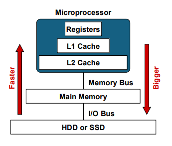

# CDA 3103 Computer Organization & Architecture - Final Exam Review

<!-- Box-Drawing Characters
─│
┌┬┐
├┼┤
└┴┘
╴╵
═║	
-->

<p style="text-align:center">
    <a href="../cda3103_textbook.pdf">textbook</a> |
    <a href="https://www.youtube.com/playlist?list=PLjrUT4yHnh3JxMGJmUCBEZklpVlTJZS94">recitations</a> |
    <a href="TODO">flashcards</a> |
    <a href="TODO">quizlet</a>
</p>

**Notice:** This exam is cumulative. Please refer to the previous two study guides for more info.

## 1. Introduction to Memory

**Notice:** The exact configuration of memory differs between machines,
however what is described is just what is typically found in a computer.

#### ***i.* Types of Memory**

- *Registers* are the fastest & smallest form of memory
- Two kinds of main memory (MM)
    - Read-only memory (ROM)
        - Does not need to be refreshed
        - Stores permanent, semi-permanent data
        - Data persists after shutdown
    - Random-access memory (RAM)
        - SRAM and DRAM
- Static RAM (SRAM)
    - More complex, faster than DRAM
    - Closer to CPU
- *Cache memory* loads data from MM
    - Typically SRAM
    - Storage here reduces average memory access time
    - Kept small to reduce search times
- Dynamic RAM (DRAM)
    - Simpler, slower than SRAM
    - Further from CPU
- DRAM uses capacitors, which leak charge and need "refreshing"
- *Main memory* loads data from disk
    - Typically DRAM
- Anything below main memory in the hierarchy is *secondary memory*
    - Permanent storage
    - Disk, flash drives, magnetic tape, etc.
- *Disk memory* is HDD, SSD, etc.
    - Larger, slower than MM


#### **Figure 2.** The Typical Memory Hierarchy
<p style="text-align:center">
    
</p>

- Memory hierarchy (closest to CPU to farthest from CPU/fastest to slowest)
    1. Registers
    2. Cache memory (typically SRAM)
    3. Main memory (typically DRAM)
    5. Disk
- If data not found at certain level, load from lower level
- The *memory bus* connects microprocessor to MM
    - Microprocessor contains L1, L2 caches and registers
- The *I/O bus* connects MM to disk

#### **Figure 3.** Memory Terminology
| Term          | Definition                                                |
|:--------------|:----------------------------------------------------------|
| hit           | Requested data resides on same level of memory            |
| miss          | Requested data does *not* reside on same level of memory  |
| hit rate      | % of requested data found in a given level of memory      |
| miss rate     | % of requested data *not* found on given level of memory  |
| hit time      | Time (ns) required to access requested data               |
| miss penalty  | Time (ns) spent processing a miss                         |

- Hit rate
    - Only significant for upper levels of memory
    - $1 - miss \space rate$
- $miss \space rate = 1 - hit \space rate$
- Miss penalty includes:
    - Time to replace block in upper memory level
    - Time to deliver the requested data to the processor

### ***ii.* Locality of Reference**

- *Locality* is principle by which certain types of data are loaded into cache
    - Loading data likely to be used into cache <ins>provides performance benefit</ins>
    - <ins>Reduces performance cost</ins> of memory system
- Temporal locality
    - *"Data used will likely be used again in the near future"*
    - Keep recently accessed data closer to CPU
    - **Application:** If out of memory, replace last-used block (TODO! name)
    - **Optimization:** Loop instructions performed many times
- Spatial locality
    - *"Data next to data used is likely to be used"*
    - Move contiguous blocks of data at a time
    - **Application:** Entire block is copied on hit
    - **Optimization:** Traversing arrays element-by-element

## 2. Direct-Mapped Cache

#### **Figure 2.** Important Units of Measurement
| Unit      | Notation  | Amount    | Binary power, $u$ |
|:----------|:---------:|:---------:|:-----------------:|
| bytes     | B         | $2^0$     | 0                 |
| kilobytes | KB        | $2^{10}$  | 10                |
| megabytes | MB        | $2^{20}$  | 20                |
| gigabytes | GB        | $2^{30}$  | 30                |

<small>\**All units assumed to be in binary*</small>

- *Direct-mapped cache* (DMC)
    - Block with index *n* in MM gets stored in block $n \space mod \space C$ of cache
        - $C$ is size of cache
    - Multiple MM blocks can map to the same cache block
        - If different tag is found, cache block is overwritten
- Memory address composed of:
    - **Block address:** *Which block?*
    - **Offset:** *Which byte in the block?*

- The *tag* denotes what specific block of MM is being stored at that location in cache
- The *index* denotes what specific block is to be accessed
- The *offset* denotes what byte of data should be accessed in that specific block
- For each block in cache, there is a *valid bit* that denotes whether the block has been populated with data since startup
    - If `0`, contains no useable data
    - If `1`, data was cached at that block previously
- The valid bit is part of the **cache**, not the physical address

#### **Figure 3.** Possibility Table for Direct-Mapped Cache
| Valid Bit | Tag       | Result    |
|:---------:|:---------:|:---------:|
| `0`       | different | miss      |
| `0`       | same      | miss      |
| `1`       | different | miss      |
| `1`       | same      | **hit**   |

```txt

      Block address
┌───────────┴───────────┐
┌────────┬──────────────┬───────────┐
| tag, T |   index, I   | offset, O |
└────────┴──────────────┴───────────┘
└─────────────────┬─────────────────┘
         Physical address, P
```

#### **Equation 1.** Size of Physical Address
>**Given:** Absolute size of main memory is $n_m \cdot 2^u$ bytes, where $u$ is the binary power of the unit<br>
>**Given:** $P$ is the size of a physical address, in bits
>
>$$
>P = \log_2{n_m} + u = \text{total no. of address bits}
>$$
>
>**Example:** If the size of main memory is 2 KB, $\log_2{2} + 10 = 1 + 10$ makes **11** bits in a physical address.
>The logarithm can also be found by knowing that $2^\textbf{1} = 2$.

#### **Equation 2.** Number of Blocks in Cache or Main Memory
>**Given:** Absolute size of main memory is $n \cdot 2^u$, where $u$ is the binary power of the unit<br>
>**Given:** Size of one block is $n_b \cdot 2^{u_b}$, where $u_b$ is also a binary power<br>
>**Given:** $b$ is the number of blocks in memory
>
>$$
>b = \frac{2^u n}{2^{u_b} n_b} = \frac{\text{size of memory}}{\text{size of block}}
>$$
>
>**Example:** If a cache is 32 B and a block consists of 8 bytes, there are 4 blocks in cache.

#### **Equation 3.** Size of Block Index
>**Given:** $b_c$ is the number of blocks in cache memory (see *Equation 2*)<br>
>**Given:** $I$ is the portion of the physical address reserved for the index, in bits
>
>$$
>I = \log_2{b_c} = \text{no. of index bits}
>$$
>
>Or in other words, if there are $2^k$ cache blocks, there are $k$ index bits.
>
>**Example:** The index represents the position of a block in cache.
>If there are 4 cache blocks, $b_c$, they are addressable by $\log_2{4} = 2$ bits.

#### **Equation 4.** Size of Offset
>**Given:** $n_c$ is the size of the cache, in bytes<br>
>**Given:** Size of one block is $n_b \cdot 2^{u_b}$, where $u_b$ is the binary power of the unit<br>
>**Given:** $O$ is the portion of the physical address reserved for the offset, in bits
>
>$$
>O = \log_2{(2^{u_b}n)} = \text{no. of offset bits}
>$$
>
>Or in other words, if there are $2^k$ bytes in a block, there are $k$ offset bits.
>
>**Example:** If a cache is 32 bytes, the size of the *offset* is $\log_2{32} = 5$ bits.
>Similarly, this logarithm can be found by knowing that $2^\textbf{5} = 32$.

#### **Equation 5.** Size of Tag
>**Given:** $P$, $I$, and $O$ are the size of the physical address, index, and offset, in bits respectively<br>
>**Given:** $T$ is the portion of the physical address reserved for the tag, in bits
>
>$$
>T = P - I - O = \text{no. of tag bits}
>$$
>
>**Example:** If 

>**Example:**
>
>
>
> ```txt
>Cache 
>┌─────┐ ┌─────┐
>|  0  | |  0  |
>├─────┤ ├─────┤
>|  1  | |  1  |
>├─────┤ ├─────┤
>|  2  | |  2  |
>├─────┤ ├─────┤
>|  3  | |  3  |
>└─────┘ ├─────┤
>        |  4  |
>        ├─────┤
>        |  5  |
>        ├─────┤
>        |  6  |
>        ├─────┤
>        |  7  |
>        └─────┘
>```

#### **Equation 6.** Hit Rate
>**Given:** esf<br>
>**Given:** $T$ is the portion of the physical address reserved for the tag, in bits
>
>$$
>T = P - I - O = \text{\# of tag bits}
>$$

- If given a memory address in decimal or hexadecimal, convert it to binary to derive the individual components, as designated by the above equations

## 3. Associative Caches

### ***i.* Fully-Associative Cache**

- 

### ***ii.* Set-Associative Cache**
check # no of sets

set index = # blocks / # sets

```txt
┌──────────┬────────────────────────────┐
|  tag, T  | set index, I_s | offset, O |
└──────────┴────────────────────────────┘
└──────────────────┬────────────────────┘
          Physical address, P
```
2-way
4-way
8-way

FA is 1-way
DMC is 0-way
>**Example:**
>
>

#### **Equation 6.** Size of Set Index
>**Given:** $b_c$ is the number of blocks in cache memory (see *Equation 2*)<br>
>**Given:** $I$ is the portion of the physical address reserved for the set index, in bits<br>
>**Given:** $s$ is number of sets in cache
>
>$$
>I_s = \log_2{\frac{b_c}{s}} = \text{\# of set index bits}
>$$
>
>**Example:** The set index represents the position of a set in cache.
>If there are 64 cache blocks, $b_c$, and 8 sets, $s$ , they are addressable by $\log_2{\frac{64}{8}} = 2$ bits.
>Additionally, from this we can conclude that there are $64 / 8 = 8$ blocks per set.

### ***iii.* Replacement Policies**

- Since in associative cache, MM blocks are are not assigned to any particular cache block, multiple ways of replacing data if cache is full
    - Random, FIFO, and LRU replacement policies
- The block to be overwritten is the *victim block*
    - On overwrite, is *evicted*
- *Random replacement* dictates that a random block will be evicted
- *First-in-first-out* (FIFO) dictates that the block last cached will be evicted
    - *"First come, first serve"*
- *Least-recently-used* (LRU) dictates that the block that has not been used the longest will be evicted
    - Requires that a table be implemented to keep track of usage history for every block
    - Less performant than other policies
- Optimal replacement policies
    - For temporal locality, LRU replacement
    - For spatial locality, random or FIFO replacement

check # no of blocks
check every single block if tag equals tag of memory block

```txt
┌──────────┬────────────────────────┐
|  tag, T  |       offset, O        |
└──────────┴────────────────────────┘
└─────────────────┬─────────────────┘
         Physical address, P
```

 m blocks, m comparators

SA - 2 sets/2cmp, 4 sets/4 cmp, 8 sets/8 cmp
DMC - 1 set (cmp tag to 1 thing)
FA - 1 set PER block
SA - per set

- Write policies
    !write through
        required: valid bit
        always latest data
        every time, update that with new piece of data
        not fully utilizing cache
        every time storing something to cache, update main-memory

2way set associative - each cache block can hold 2 pieces of data at same time 2 ways of storing that data

    !write back
        required: valid bit, modified bit (in cache, too) -- tells if piece of data was modified at some point
        takes less time
        data is not always up to date in MM
        uses more memory (metadata abt modification)
        only updates when replaced

>**Example:**
>
>

## 4. Virtual Memory

TODO

- More capacity without adding more memory


FA

no need to index

TAG OfFset

------------

there is a page table for every active process (program, thread, etc)

virtual memory exists because it is easier for programmers and users to use

n-way = n blocks in each set

! each set is the row in the diagram that was on the slides

----------
virtual memory (VM) holds more data than physical memory (PM)

page frames: PM
pages: holding frames VM

fragmentation: memory becomes unusable
    internal:
    external:

page fault: requesting page that is not loaded

TLB -> table lookup buffer
    special cache
    maps virtual address to physical address (VA -> PA)
    result: we have a lot of space, a lot faster

VM steps:
    1. get page # from VA -> use TLB
    2. find the frames
    3. check if its valid
        if VB is 1, good; if 0, page fault--retrieve from disk


>**Example:** Given the virtual address 11010100
>
>Because there are 4 rows, each frame is addressable by $4 = 2^2 \rightarrow 2$ bits.
>From the address,
>
>```txt
>Page #  Frame   VB
>       ┌─────┬─────┐
>   0   |  1  |  1  |
>       ├─────┼─────┤
>   1   |  -  |  0  |
>       ├─────┼─────┤
>   2   |  -  |  0  |
>       ├─────┼─────┤
>   3   |  0  |  1  |
>       └─────┴─────┘
>```
>


VA: | PAGE | OFFSET |
PA: | FRAME | OFFSET |  -- frame from table , rest is same
OFFSETS ARE THE SAME, FRAME #  SMALLER THAN PAGE #
if 2^3 pages, first 3 bits are page #


─│
┌┬┐
├┼┤
└┴┘
╴╵
═║	