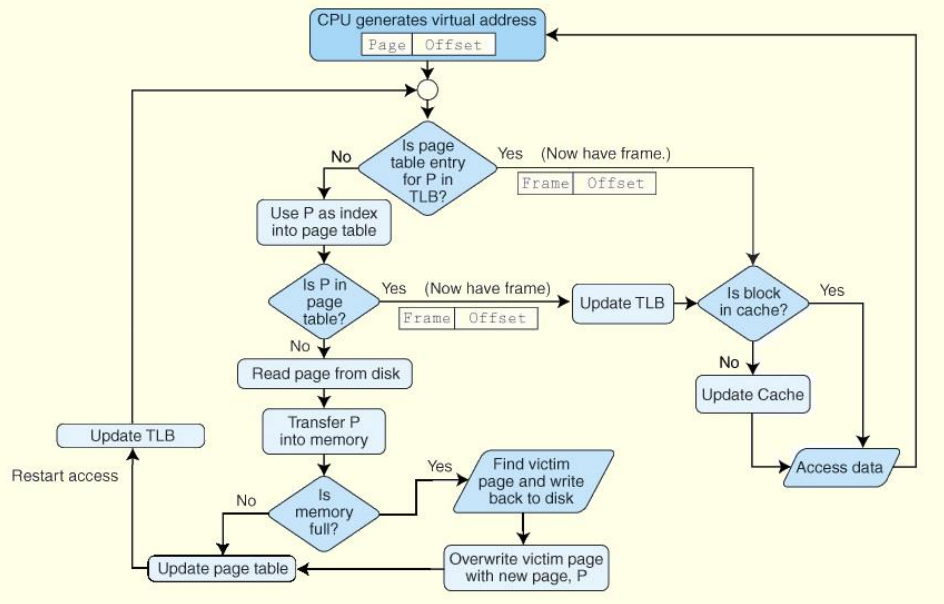

# CDA 3103 Computer Organization & Architecture - Final Exam Review

<!-- Box-Drawing Characters
─│
┌┬┐
├┼┤
└┴┘
╴╵
═║	
-->

<p style="text-align:center">
    <a href="../cda3103_textbook.pdf">textbook</a> |
    <a href="https://www.youtube.com/playlist?list=PLjrUT4yHnh3JxMGJmUCBEZklpVlTJZS94">recitations</a> |
    <a href="TODO">flashcards</a> |
    <a href="TODO">quizlet</a>
</p>

**Notice:** This exam is cumulative. Please refer to the previous two study guides for more info.

#### Common Abbreviations
| Abbreviation  | Meaning                       |
|:--------------|:------------------------------|
| ROM           | read-only memory              |
| RAM           | random-access memory          |
| DMC           | direct-mapped cache           |
| VB            | valid bit                     |
| MM            | main memory                   |
| FA            | fully-associative             |
| SA            | set-associative               |
| PM            | physical memory               |
| VM            | virtual memory                |
| PA            | physical address              |
| VA            | virtual address               |
| TLB           | translation lookaside buffer  |

## 1. Introduction to Memory

**Notice:** The exact configuration of memory differs between machines,
however what is described is just what is typically found in a computer.

#### ***i.* Types of Memory**

- *Registers* are the fastest & smallest form of memory
- Two kinds of computer memory
    - Read-only memory (ROM)
        - Does not need to be refreshed
        - Stores permanent, semi-permanent data
        - Data persists after shutdown
    - Random-access memory (RAM)
        - SRAM and DRAM
- Static RAM (SRAM)
    - More complex, faster than DRAM
    - Closer to CPU
- *Cache memory* loads data from MM
    - Typically SRAM
    - Storage here reduces average memory access time
    - Kept small to reduce search times
- Dynamic RAM (DRAM)
    - Simpler, slower than SRAM
    - Further from CPU
- DRAM uses capacitors, which leak charge and need "refreshing"
- *Main memory* (MM) loads data from disk
    - Typically DRAM
- Anything below main memory in the hierarchy is *secondary memory*
    - Permanent storage
    - Disk, flash drives, magnetic tape, etc.
- *Disk memory* is HDD, SSD, etc.
    - Larger, slower than MM

#### **Figure 2.** The Typical Memory Hierarchy
<p style="text-align:center">
    
</p>

- Memory hierarchy (closest to CPU to farthest from CPU/fastest to slowest)
    1. Registers
    2. Cache memory (typically SRAM)
    3. Main memory (typically DRAM)
    5. Disk
- If data not found at certain level, load from lower level
- The *memory bus* connects microprocessor to MM
    - Microprocessor contains L1, L2 caches and registers
- The *I/O bus* connects MM to disk

#### **Figure 3.** Memory Terminology
| Term          | Definition                                                |
|:--------------|:----------------------------------------------------------|
| hit           | Requested data resides on same level of memory            |
| miss          | Requested data does *not* reside on same level of memory  |
| hit rate      | % of requested data found in a given level of memory      |
| miss rate     | % of requested data *not* found on given level of memory  |
| hit time      | Time (ns) required to access requested data               |
| miss penalty  | Time (ns) spent processing a miss                         |

- Hit rate
    - Only significant for upper levels of memory
    - $1 - miss \space rate$
- $miss \space rate = 1 - hit \space rate$
- Miss penalty includes:
    - Time to replace block in upper memory level
    - Time to deliver the requested data to the processor

### ***ii.* Locality of Reference**

- *Locality* is principle by which certain types of data are loaded into cache
    - Loading data likely to be used into cache <ins>provides performance benefit</ins>
    - <ins>Reduces performance cost</ins> of memory system
- Temporal locality
    - *"Data used will likely be used again in the near future"*
    - Keep recently accessed data closer to CPU
    - **Application:** If out of memory, replace last-used block (TODO! name)
    - **Optimization:** Loop instructions performed many times
- Spatial locality
    - *"Data next to data used is likely to be used"*
    - Move contiguous blocks of data at a time
    - **Application:** Entire block is copied on hit
    - **Optimization:** Traversing arrays element-by-element

## 2. Direct-Mapped Cache

#### **Figure 2.** Important Units of Measurement
| Unit      | Notation  | Amount    | Binary power, $u$ |
|:----------|:---------:|:---------:|:-----------------:|
| bytes     | B         | $2^0$     | 0                 |
| kilobytes | KB        | $2^{10}$  | 10                |
| megabytes | MB        | $2^{20}$  | 20                |
| gigabytes | GB        | $2^{30}$  | 30                |

<small>\**All units assumed to be in binary*</small>

- *Direct-mapped cache* (DMC)
    - Block with index *n* in MM gets stored in block $n \space mod \space C$ of cache
        - $C$ is size of cache
    - Multiple MM blocks can map to the same cache block
        - If different tag is found, cache block is overwritten

>**Example 1.** In the following diagram
>- Block 0 maps to block $0 \space mod \space 4 = 0$
>- Block 2 maps to block $2 \space mod \space 4 = 2$
>- Block 5 maps to block $5 \space mod \space 4 = 1$
>- Block 7 maps to block $7 \space mod \space 4 = 3$
>
> ```txt
>  Cache         MM
>┌─────┐      ┌─────┐
>|  0  | <─── |  0  |
>├─────┤      ├─────┤
>|  1  | <─┐  |  1  |
>├─────┤   │  ├─────┤
>|  2  | <─┼─ |  2  |
>├─────┤   │  ├─────┤
>|  3  | <┐│  |  3  |
>└─────┘  ││  ├─────┤
>          ││  |  4  |
>          ││  ├─────┤
>          │└─ |  5  |
>          │   ├─────┤
>          │   |  6  |
>          │   ├─────┤
>          └── |  7  |
>              └─────┘
>```

- Memory address composed of:
    - **Block address:** *Which block?*
    - **Offset:** *Which byte in the block?*
- The *tag* denotes what specific block of MM is being stored at that location in cache
- The *index* denotes what specific block is to be accessed
- The *offset* denotes what byte of data should be accessed in that specific block

#### **Figure 3.** Physical Address with Direct-Mapped Cache
```txt
      Block address
┌───────────┴───────────┐
┌────────┬──────────────┬───────────┐
| tag, T |   index, B   | offset, O |
└────────┴──────────────┴───────────┘
└─────────────────┬─────────────────┘
         Physical address, P
```

- For each block in cache, there is a *valid bit* that denotes whether the block has been populated with data since startup
    - If `0`, contains no useable data
    - If `1`, data was cached at that block previously
- The valid bit (VB) is part of the **cache**, not the physical address

#### **Figure 4.** Possibility Table for Direct-Mapped Cache
| Valid Bit | Tag       | Result    |
|:---------:|:---------:|:---------:|
| `0`       | different | miss      |
| `0`       | same      | miss      |
| `1`       | different | miss      |
| `1`       | same      | **hit**   |


- For the following equations, $||$ corresponds to *"size of"*
- If given a memory address in decimal or hexadecimal, convert it to binary to derive the individual components, as designated by the above equations
- All equations assume memory is byte-addressable

#### **Equation 1.** Size of Physical Address
>**Given:** Absolute size of main memory is $n_m \cdot 2^u$ bytes, where $u$ is the binary power of the unit<br>
>**Given:** $P$ is the size of a physical address, in bits
>
>$$
>P = \log_2{n_m} + u = \text{total no. of address bits}\newline
>|\text{main memory}| = 2^u + 2^{n_m} \text{ bytes} \rightarrow u
>$$
>
>---
>
>**Example:** If the size of main memory is 2 KB, then $n_m = 2$ and $u = 10$.
>
>$$
>\log_2{2} + 10 = 1 + 10 = 11 \text{ bits in a physical address } \checkmark
>$$
>
>The logarithm can also be found by knowing that $2^\textbf{1} = 2$.

#### **Equation 2.** Number of Blocks in Cache or Main Memory
>**Given:** Absolute size of memory is $n \cdot 2^u$, where $u$ is the binary power of the unit<br>
>**Given:** Size of one block is $n_b \cdot 2^{u_b}$, where $u_b$ is also a binary power<br>
>**Given:** $b$ is the number of blocks in memory
>
>$$
>b = \frac{2^u n}{2^{u_b} n_b} = \frac{\text{size of memory}}{\text{size of block}}
>$$
>
>---
>
>**Example:** If a cache is 32 B and a block consists of 8 bytes, then $n = 32$, $u = 0$, $n_b = 8$, and $u_n = 0$.
>
>$$
>\frac{2^0 \cdot 32}{2^0 \cdot 8} = \frac{32}{8} = 4 \text{ blocks in cache } \checkmark
>$$

#### **Equation 3.** Size of Block Index
>**Given:** $b_c$ is the number of blocks in cache memory (see *Equation 2*)<br>
>**Given:** $B$ is the portion of the physical address reserved for the index, in bits
>
>$$
>B = \log_2{b_c} = \text{no. of index bits}
>$$
>
>Or in other words, if there are $2^k$ cache blocks, there are $k$ index bits.
>
>---
>
>**Example:** The index represents the position of a block in cache.
>If there are 4 cache blocks, then $b_c = 4$.
>
>$$
>\log_2{4} = 2 \text{ bits for block index } \checkmark
>$$
>
>The logarithm can also be found by knowing that $2^\textbf{2} = 4$.

#### **Equation 4.** Size of Offset
>**Given:** Size of one block is $n_b \cdot 2^{u_b}$, where $u_b$ is the binary power of the unit<br>
>**Given:** $O$ is the portion of the physical address reserved for the offset, in bits
>
>$$
>O = \log_2{(2^{u_b}n)} = \text{no. of offset bits}
>$$
>
>Or in other words, if there are $2^k$ bytes in a block, there are $k$ offset bits.
>
>---
>
>**Example:** If a cache is 32 bytes, $n = 32$ and $u_b = 0$
>
>$$
>\log_2{(2^0 \cdot 32)} = \log_2{32} = 5 \text{ bits for offset } \checkmark
>$$
>
>This logarithm can also be found by knowing that $2^\textbf{5} = 32$.

#### **Equation 5.** Size of Tag for Direct-Mapped Cache
>**Given:** $P$, $B$, and $O$ are the size of the physical address, index, and offset, in bits respectively<br>
>**Given:** $T$ is the portion of the physical address reserved for the tag, in bits
>
>$$
>T = P - B - O = \text{no. of tag bits}
>$$
>
>---
>
>**Example:** If there are 11 bits in a physical address, 2 are for the block index, and 5 are for the offset
>
>$$
>11 - 2 - 5 = 4 \text{ bits for tag } \checkmark
>$$

- Performance of DMC suffers when block at given index is repeatedly overwritten
    - Known as *thrashing*

## 3. Associative Caches

### ***i.* Fully-Associative Cache**

- In a *fully-associative* (FA) cache, blocks are stored in the next available cache block
    - No specific mapping scheme means block index is absent

#### **Figure 5.** Physical Address with Fully-Associative Cache
```txt
┌──────────────┬────────────────────────┐
|    tag, T    |        offset, O       |
└──────────────┴────────────────────────┘
└──────────────────┬────────────────────┘
          physical address, P
```

#### **Equation 6.** Size of Tag for Fully-Associative Cache
>**Given:** $P$ and $O$ are the size of the physical address, and offset, in bits respectively<br>
>**Given:** $T$ is the portion of the physical address reserved for the tag, in bits
>
>$$
>T = P - O = \text{no. of tag bits}
>$$

### ***ii.* Set-Associative Cache**

- In a *set-associative* (SA) cache, blocks are mapped to a specific set
    - Block index replaced with set index
- Within each set, blocks are stored as they would be in a fully-associative cache—that is, in no particular order

#### **Figure 6.** Physical Address with Set-Associative Cache
```txt
┌──────────┬────────────────────────────┐
|  tag, T  | set index, I_s | offset, O |
└──────────┴────────────────────────────┘
└──────────────────┬────────────────────┘
          physical address, P
```

#### **Equation 7.** Size of Tag for Set-Associative Cache
>**Given:** $P$, $I_s$, and $O$ are the size of the physical address, set index, and offset, in bits respectively<br>
>**Given:** $T$ is the portion of the physical address reserved for the tag, in bits
>
>$$
>T = P - I_s - O = \text{no. of tag bits}
>$$

- A set-associative cache is $n$-way if each set contains $n$ blocks
    - Typically a power of 2 to make calculations easier

#### **Equation 6.** Size of Set Index
>**Given:** $b_c$ is the number of blocks in cache memory (see *Equation 2*)<br>
>**Given:** $I$ is the portion of the physical address reserved for the set index, in bits<br>
>**Given:** $s$ is number of sets in cache
>
>$$
>I_s = \log_2{\frac{b_c}{s}} = \text{\# of set index bits}
>$$
>
>---
>
>**Example:** The set index represents the position of a set in cache.
>If there are 64 cache blocks and 8 sets, $b_c = 64$ and $s = 8$.
>
>$$
>\log_2{\frac{64}{8}} = \log_2{4} = 2 \text{ bits for set index } \checkmark
>$$
>
>From this, we can also conclude that there are $\frac{64}{8} = 8$ blocks per set.

- SA caches implemented using comparators, which determines whether access is a hit 
    - One comparator per set

### ***iii.* Replacement Policies**

- Since in associative cache, MM blocks are are not assigned to any particular cache block, multiple ways of replacing data if cache is full
    - Random, FIFO, and LRU replacement policies
- The block to be overwritten is the *victim block*
    - On overwrite, is *evicted*
- *Random replacement* dictates that a random block will be evicted

#### **Figure 7.** Random Replacement Policy
```txt
      ┌───┐
      | 7 |
      └───┘
        |
        └─┐ (victim block chosen randomly)
          ↓
┌───┬───┬───┬───┐
| 1 | 2 | 3 | 4 | (full cache)
└───┴───┴───┴───┘
    ⇓   ⇓   ⇓
┌───┬───┬───┬───┐
| 1 | 2 | 7 | 4 | (victim block is discarded)
└───┴───┴───┴───┘
```

- *First-in-first-out* (FIFO) dictates that the block last cached will be evicted
    - *"First come, first serve"*

#### **Figure 7.** First-In-First-Out Replacement Policy
```txt
Blocks cached, in order: 5, 2, 4, 3

      ┌───┐
      | 7 |
      └───┘
        |
  ┌─────┘   (victim block chosen according to last cached)
  ↓
┌───┬───┬───┬───┐
| 5 | 2 | 9 | 4 |
└───┴───┴───┴───┘
    ⇓   ⇓   ⇓
┌───┬───┬───┬───┐
| 7 | 2 | 9 | 4 |
└───┴───┴───┴───┘
```

- *Least-recently-used* (LRU) dictates that the block that has not been used the longest will be evicted
    - Requires that a table be implemented to keep track of usage history for every block
    - Less performant than other policies

#### **Figure 8.** Least-Recently-Used Replacement Policy
```txt
       Cache History
─────────────┬───────────────
 Block Index | Last Use (ns)
─────────────┼───────────────
     0       |      7
     1       |      1
     2       |      16
     3       |      23

      ┌───┐
      | 7 |
      └───┘
        |
        └─────┐ (victim block chosen according to least recently used)
              ↓
┌───┬───┬───┬───┐
| 5 | 2 | 9 | 4 |
└───┴───┴───┴───┘
    ⇓   ⇓   ⇓
┌───┬───┬───┬───┐
| 5 | 2 | 9 | 7 |
└───┴───┴───┴───┘
```

- Optimal replacement policies
    - For temporal locality, LRU replacement
    - For spatial locality, random or FIFO replacement

## 4. Write Policies

- Write policies determine how modifications to cached data should be reflected in MM
    - A result of cached data being a *copy* of data in main memory
- *Write-back* policy states that any modifications made to cached data at any point should be copied back to MM
    - Very expensive
- With write-back, data in cache is always up-to-date

#### **Figure 9.** Modification Using Write-Back
```txt
             MM
 ───┬───┬───┬───┬───┬───┬───         ───┬───┬───┬───┬───┬───┬───
... | 2 | 9 | 6 | 1 | 8 | ...       ... | 2 | 9 | 6 | 2 | 8 | ... ←─┐
 ───┴───┴───┴───┴───┴───┴───         ───┴───┴───┴───┴───┴───┴───    |
                  ⇑ +1        ┌──┘╲                                 |
            Cache ║           └──┐╱                                 ├─ Memories updated simultaneously
 ───┬───┬───┬───┬───┬───┬───         ───┬───┬───┬───┬───┬───┬───    |
... | 2 | 9 | 6 | 1 | 8 | ...       ... | 2 | 9 | 6 | 2 | 8 | ... ←─┘
 ───┴───┴───┴───┴───┴───┴───         ───┴───┴───┴───┴───┴───┴───
                  ⇑ +1
```

- *Write-through* updates cached data only when being overwritten
    - Solves performance issues of write-back
- Write-through requires every block in cache to be assigned a *modified bit*
    - Similar to valid bit, is `1` if cache has been modified and needs to be copied later, otherwise `0`
- On overwrite, modified bit is reset

#### **Figure 10.** Modification Usin Write-Through
```txt
                      MM
          ───┬───┬───┬───┬───┬───┬───         ───┬───┬───┬───┬───┬───┬───
         ... | 2 | 7 | 6 | 1 | 8 | ...       ... | 2 | 7 | 6 | 1 | 8 | ... ←─┐
          ───┴───┴───┴───┴───┴───┴───         ───┴───┴───┴───┴───┴───┴───    |
                                       ┌──┘╲                                 |
                     Cache             └──┐╱                                 ├─       Memories differ
Modified:      0   1   0   0   1                   0   1   0   1   1         |  (Blocks synced on overwrite)
          ───┬───┬───┬───┬───┬───┬───         ───┬───┬───┬───┬───┬───┬───    |
         ... | 2 | 9 | 6 | 1 | 8 | ...       ... | 2 | 9 | 6 | 2 | 8 | ... ←─┘
          ───┴───┴───┴───┴───┴───┴───         ───┴───┴───┴───┴───┴───┴───
                           ⇑ +1                           
```

## 4. Virtual Memory

### ***i.* Introduction**

- *Virtual memory* is a digital system to extend main memory from the perspective of the operating system
    - Memory is not physically expanded
    - Makes memory addressing easier for programmers and end users
- Every active process creates a *page table*

#### **Figure 11.** ewgwe
```txt
┌────────────┬────────────────────────┐
|    page    |        offset          |
└────────────┴────────────────────────┘
└─────────────────┬───────────────────┘
           virtual address

     ┌───────┬────────────────────────┐
     | frame |        offset          | ← same # of bits
     └───────┴────────────────────────┘
     └───────────────┬────────────────┘
             physical address
```

- 

page frames: PM
pages: holding frames VM

- A *page fault* occurs when the requested page has not yet been loaded from MM
- The *translation lookaside buffer* (TLB) caches virtual-to-physical address conversions
    - Increases performance of page frame lookup

- Memory divided into equal-length frames and pages

- The frame is derived from the page table, contained by the row at index *page*

- Frame number is smaller than page number, as there are more pages than page frames
    - Page size same as frame size, and since virtual memory is larger, it has more pages

#### **Equation 7.** Page (Frame) Index
>**Given:**<br>
>**Given:**
>
>$$
>
>$$
>
>---
>
>**Example:**
>
>$$
>
>$$

CHECK IN THE MORNING
#### **Equation 8.** Effective Access Time
>**Given:** $r_H$ and <br>
>**Given:** $T$ is the effective access time (EAT), in nanoseconds
>
>$$
>r_Ht_H + (1 - r_H)t_M\newline
>
>$$

- Memory lookup process:
    1. Look up page frame index, using TLB if possible
    2. Check if valid bit in page table is `1`—if not, retrieve page from disk (page fault)
    3. With the page frame, check if block is in cache—if not, retrieve from main memory (miss)

#### **Figure 13.** Combined Memory Lookup Process
<p style="text-align:center">
    
</p>

### ***ii.* Fragmentation**

- Fragmentation is the loss of usable memory due to mismanagement of how memory is allocated
- *Internal fragmentation* occurs when

FIGURE

- *External fragmentation* occurs when

FIGURE

- *Compaction* is the process of 

## 5. Pipelining

WATCH ROBERT
- 