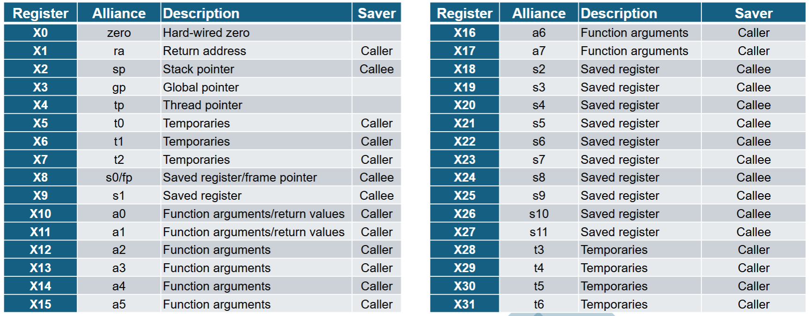

# CDA 3103 Computer Organization & Architecture - Exam 2 Review

<p style="text-align:center">
    <a href="../textbooks/CDA3103_textbook.pdf">textbook</a> |
    <a href="https://quizlet.com/845007313/cda-3103-exam-2-risc-v-logic-gate-circuits-flash-cards">quizlet</a>
</p>

### SI Unit Prefixes 
| Prefix    | Symbol    | Value         |
|-----------|-----------|---------------|
| femto-    | f         | $10^{-15}$    |
| pico-     | p         | $10^{-12}$    |
| nano-     | n         | $10^{-9}$     |
| micro-    | $\mu$     | $10^{-6}$     |
| milli-    | m         | $10^{-3}$     |
| kilo-     | k         | $10^3$        | 
| mega-     | M         | $10^6$        |
| giga-     | G         | $10^9$        |
| tera-     | T         | $10^{12}$     |
| peta-     | P         | $10^{15}$     |

## 1. Logic Gates, Multiplexers, and Decoders

- Boolean expressions can be represented as a diagram of *logic gates*
    - Composed of transistors
    - All except NOT can accept any number of inputs

### Common Logic Gates
| Name  | Symbol                                | Requisite for Signal Output   | Boolean Equivalent            |
|-------|---------------------------------------|-------------------------------|-------------------------------|
| NOT   |   | No input signal               | x', $\bar{x}$                 |
| AND   |   | All input signals             | xy                            |
| OR    |    | Any input signal              | x + y                         |
| XOR   |   | Exactly one input signal      | x $\oplus$ y, x'y + xy'       |
| NAND  |  | Absence of any input signal   | (xy)'                         |
| NOR   |   | No input signals              | (x + y)'                      |
| XNOR  |  | Equal input signals           | (x $\oplus$ y)', x'y' + xy    |

- A *multiplexer* takes 

## 2. Combinational Circuits

- *Combinational circuits* comprised of:
    - Basic boolean operations as logic gates
    - Input(s)
    - Output(s)
- Output is function of input
    - Same output given same input

## 3. Sequential Circuits

- Hold and use data, typically 1 bit, from previous input(s) to produce next output(s)

There are multiple types, but all of them are going to be either synchronous or asynchronous. 
- **Synchronous circuits** respond to inputs only when the clock is in a rising state (going from 0 to 1). Most sequential circuits are synchronous.
- **Asynchronous circuits** respond to inputs all the time (they don't have a clock).

### Basic Sequential Circuit Types

#### **Set-Reset Latch**

- Holds one bit of data. It is also the smallest circuit capable doing this.
- Is asynchronous. It doesn't have a clock.
- Can have an undefined state (its data is invalid).

**Circuit:**  

  

**Truth table:**
| S (Set)   | R (Reset) | Qt | Q(t+1) |
|--------|:---------:|:-----------------:|:-------------------:|
|   0     |     0     |         0         |          0          |
|   0     |     0     |         1         |          1          |
|   0     |     1     |         0         |          0          |
|   0     |     1     |         1         |          0          |
|   1     |     0     |         0         |          1          |
|   1     |     0     |         1         |          1          |
|   1     |     1     |         X         |        Invalid       |


#### Set-Reset Flip-Flop

- Same basic logic as a Set-Reset Latch (see above table and description).
- Only updates when a signal from a clock is received.
- Circuit is the same as a Set-Reset Latch but modified with AND gates to account for the clock.

**Circuit:**


You will more commonly see this as a **block diagram**:


*Click [Here](https://circuitverse.org/users/269149/projects/sr-flip-flop-0b7a0de1-fe11-40df-9094-3a27b6963370) for a working model of this circuit*

#### D Flip-Flop

- A modified SR Flip-Flop in which only one input (SET) is needed.
- Reset is always the opposite of Set.
- The information stored in a D Flip-Flop is only changed when the input changes.
- Subsequent clock pulses do not effect the data stored.

**Circuit:**


**Truth Table:**

| D | Q(t + 1) |
|:-----:|:-----:|
|   0   |   0   |
|   1   |   1   |

*Click [Here](https://circuitverse.org/users/269149/projects/d-flip-flop-40d49df4-0896-410a-bbd5-16acdd8883ae) for a working model of this circuit*

#### JK Flip-Flop

- A modified SR Flip-Flop in which Set and Reset can both be 1.
- Set is denoted with J and Reset is denoted with K.
- When J and K are both 1, Q(t+1) gets set to the complement of Q(t).

**Circuit:**


**Truth Table:**
| J (Set) | K (Reset) | Q(t) | Q(t + 1) |
|:-----:|:-----:|:-----:|:-----:|
|   0   |   0   |   0   |   0   |
|   0   |   0   |   1   |   1   |
|   0   |   1   |   0   |   0   |
|   0   |   1   |   1   |   0   |
|   1   |   0   |   0   |   1   |
|   1   |   0   |   1   |   1   |
|   1   |   1   |   0   |   1   |
|   1   |   1   |   1   |   0   |

*Click [Here](https://circuitverse.org/users/269149/projects/jk-flip-flop-5d11e97f-e706-45b7-9dd6-fba45eb3f167) for a working model of this circuit*

Convert circuit to boolean expression by working backwards from last logic gate (give example with AST)


Additional identities


## 4. RISC-V Assembly

- *RISC-V* is a free and open-source instruction set architecture (ISA)
    - Specification defines

### Registers
Registers store 32-bit values. RISC-V has 32 registers to work with.




**X0 (zero):** Hardwired value to 0. Can be used to initialize other registers.
**X5-X7 & X28-X31 (t0-t6):** Used to hold temporary values in registers.
**X8-X9 & X18-X27 (s0-s11):** Can also be used to hold temporary values in registers.
**X10-X11 (a0-a1):** Can be used to hold function arguments or return values.
**X12-X17 (a2-a7):** Can be used to hold function arguments.

### R-Type Instructions
#### Arithmetic Instructions
`ADD rd, rs1, rs2 #rd = rs1 + rs2`
- Adds the values from registers `rs1` and `rs2` and stores the result in `rd`.

`SUB rd, rs1, rs2 #rd = rs1 - rs2`
- Subtracts the values of `rs1` from `rs2` and stores the result in `rd`. **Order is important here**.

`SLT rd, rs1, rs2 #rs1 <s rs2`
- Compares the signed values of `rs1` and `rs2`. If `rs1` is less than `rs2`, then `rd` will be 1. Otherwise, `rd` will be 0.

`SLTU rd, rs1, rs2 #rs1 <s rs2`
- Compares the unsigned values of `rs1` and `rs2`. If `rs1` is less than `rs2`, then `rd` will be 1. Otherwise, `rd` will be 0.

#### Logical Instructions
`AND rd, rs1, rs2`
- Does logical and using the values of `rs1` and `rs2` on each bit and stores the result in `rd`.

`OR rd, rs1, rs2`
- Does logical or using the values of `rs1` and `rs2` on each bit and stores the result in `rd`.

`XOR rd, rs1, rs2`
- Does logical exclusive or using the values of `rs1` and `rs2` on each bit and stores the result in `rd`.

#### Shifting Instructions
`SLL rd, rs1, rs2`
- Does logical left shifting on `rs1` using the lower 5-bits of `rs2`. Inserts zeros to the least significant bit and shifts out the most significant bit.

`SRL rd, rs1, rs2`
- Does logical right shifting on `rs1` using the lower 5-bits of `rs2`. Inserts zeros to the most significant bit and shifts out the least significant bit.

`SRA rd, rs1, rs2`
- Does arithmetic right shifting on `rs1` using the lower 5-bits of `rs2`. Inserts sign bit to the most significant bit and shifts out the least significant bit.

### I-Type Instructions
- I-Type instructions can be used either for immediate arithmetical, logical or shifting instructions, or for memory reading.

- Arithmetic, logical, and shifting is similar to R-Type. `rs2` gets replaced by `Imm` which is a 12-bit value with a data range of [-2048, 2047].

#### Arithmetic Instructions
`ADDI rd, rs1, Imm #rd = rs1 + Imm`
- Adds the values from register `rs1` with `Imm` and stores the result in `rd`.
- There is no SUBI as `Imm` can be a negative number.
- Useful for initializing constants from C code. Example `ADDI t0, zero, 20 #t0 = 20`.

`SLTI rd, rs1, Imm #rs1 <s rs2`
- Compares the signed values of `rs1` and `Imm`. If `rs1` is less than `Imm`, then `rd` will be 1. Otherwise, `rd` will be 0.

`SLTIU rd, rs1, Imm #rs1 <s rs2`
- Compares the signed values of `rs1` and `Imm`. If `rs1` is less than `Imm`, then `rd` will be 1. Otherwise, `rd` will be 0.

#### Logical Instructions
`ANDI rd, rs1, Imm`
- Does logical and using the values of `rs1` and `Imm` on each bit and stores the result in `rd`.
- The ANDI instruction can be used to clear some specific bits since `x and 0 = 0`.
- The ANDI instruction can also be used to find the modulo of 2^n. Example C: `X % 16` -> Example RISC-V: `ANDI t1, t0, 15`.

`ORI rd, rs1, Imm`
- Does logical or using the values of `rs1` and `Imm` on each bit and stores the result in `rd`.
- The ORI instruction can be used to set some specific bits since `x or 1 = 1`.

`XORI rd, rs1, Imm`
- Does logical exclusive or using the values of `rs1` and `Imm` on each bit and stores the result in `rd`.
- There is no NOT instruction in RISC-V, but XORI can be used in it's place: `XORI t1, t0, -1 # t1 = NOT t0`

#### Shifting Instructions
`SLLI rd, rs1, Imm`
- Does logical left shifting on `rs1` by the value of `Imm`. Inserts zeros to the least significant bit and shifts out the most significant bit.
- Can be used for multipling with 2^n constants. Example: `SLLI t2, t0, 2 # t2 = t0 * 4`
- If the constant is not a power of 2, then use multiple left shifts and add together at the end. Example:

```
C: j = h * 6

RISC-V:
SLLI t1, t0, 1 # t1 = t0 * 2
SLLI t2, t0, 2 # t2 = t0 * 4
ADD t3, t1, t2 # t3 = t1 + t2 = 6 * t0
```

`SRLI rd, rs1, Imm`
- Does logical right shifting on `rs1` by the value of `Imm`. Inserts zeros to the most significant bit and shifts out the least significant bit.

`SRAI rd, rs1, Imm`
- Does arithmetic right shifting on `rs1` by the value of `Imm`. Inserts sign bit to the most significant bit and shifts out the least significant bit.
- Can be used for dividing with 2^n constants. Example: `SRAI t1, t0, 1 # t1 = t0/2`

#### Memory Reading Instructions
Used for reading values from arrays.

`LB rd, Imm(rs1)`
- Loads 1 byte (8-bits) from the memory address `rs1` + `Imm` offset and sign extends it.

`LH rd, Imm(rs1)`
- Loads 2 bytes (16-bits) from the memory address `rs1` + `Imm` offset and sign extends it.

`LW rd, Imm(rs1)`
- Loads 4 bytes (32-bits) from the memory address `rs1` + `Imm` offset.

`LBU rd, Imm(rs1)`
- Loads 1 byte (8-bits) from the memory address `rs1` + `Imm` offset and zero extends it.

`LHU rd, Imm(rs1)`
- Loads 2 bytes (16-bits) from the memory address `rs1` + `Imm` offset and zero extends it.

### S-Type Instructions
Used for writing values to arrays.

`SB rs2, Imm(rs1)`
- Saves lower 1 byte (8-bits) of `rs2` to the memory address `rs1`  + `Imm` offset.

`SH rs2, Imm(rs1)`
- Saves lower 2 byte (16-bits) of `rs2` to the memory address `rs1`  + `Imm` offset.

`SW rs2, Imm(rs1)`
- Saves 4 byte (32-bits) of `rs2` to the memory address `rs1`  + `Imm` offset.

### U-Type Instructions
`LUI rd, Imm`
- Used to initialize big values with `Imm` (20-bits) in the upper bits of `rd`. Examples:
```
0xABCDE265

LUI t0, 0xABCDE
ADDI t0, t0, 0x265

0xABCDE965
LUI t1, 0xABCDF
ADDI t1, t1, 0x965
```
- If d11 in the hex value is 1 (Ex: 9 = 1001), then add one to `Imm` as shown in the 2nd example.


### B-Type Instructions
Used for comparing values between registers to jump to different branches of RISC-V code.

`BEQ rs1, rs2, Imm`
- Compares `rs1` and `rs2`. If **they are equal** then go to `Imm` branch.

`BNE rs1, rs2, Imm`
- Compares `rs1` and `rs2`. If **they are not equal** then go to `Imm` branch.

`BLT rs1, rs2, Imm`
- Compares `rs1` and `rs2`. If **`rs1` is less than `rs2`** then go to `Imm` branch. Signed Comparison.
- If you have `a > c` in C code, then you can make the same comparison using `BLT` *but switch the values around*.

`BGE rs1, rs2, Imm`
- Compares `rs1` and `rs2`. If **`rs1` is greater than or equal to `rs2`** then go to `Imm` branch. Signed Comparison.
- If you have `a <= c` in C code, then you can make the same comparison using `BGE` *but switch the values around*.

`BLTU rs1, rs2, Imm`
- Compares `rs1` and `rs2`. If **`rs1` is less than `rs2`** then go to `Imm` branch. Unsigned Comparison.
- If you have `a > c` in C code, then you can make the same comparison using `BLTU` *but switch the values around*.

`BGEU rs1, rs2, Imm`
- Compares `rs1` and `rs2`. If **`rs1` is greater than or equal to `rs2`** then go to `Imm` branch. Unsigned Comparison.
- If you have `a <= c` in C code, then you can make the same comparison using `BGEU` *but switch the values around*.

***WIP***