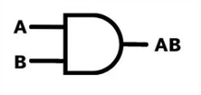
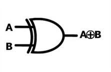
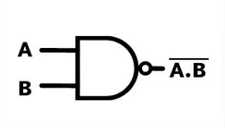
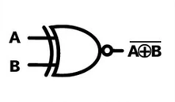
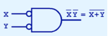
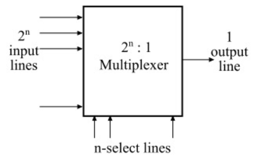
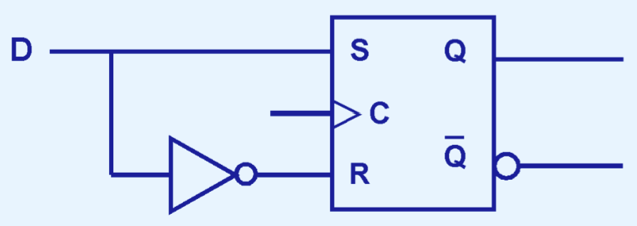
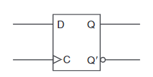

# CDA 3103 Computer Organization & Architecture - Exam 2 Review

<!-- Use 'img' tags when image resizing is needed. -->
<!-- Use 'table' tag to display images side-by-side. -->
<!-- GitHub renders instructions & circuit images in tables with proper alignment/width. -->

<p style="text-align:center">
    <a href="../textbooks/CDA3103_textbook.pdf">textbook</a> |
    <a href="https://quizlet.com/845007313/cda-3103-exam-2-risc-v-logic-gate-circuits-flash-cards">quizlet</a> |
    <a href="https://www.youtube.com/playlist?list=PLjrUT4yHnh3JxMGJmUCBEZklpVlTJZS94">recitations</a>
</p>

## 1. Logic Gates & Combinational Circuits

- Presence of electricity in some part of a circuit is a *signal*
    - Represents `1`
    - Absence represents `0`
- Boolean expressions can be represented as a diagram of *logic gates*
    - Composed of transistors
    - All except NOT can accept any number of input (incoming) signals
- All other gates can be created from NAND and NOR gates
    - "Universal gates", more commonly NAND

<!-- Images in the following tables are not perfectly aligned--leave as-is. -->

### Common Logic Gates
| Name  | Symbol                                        | Requisite for Signal Output   | Boolean Equivalent            | Simplified Form   | NAND Form     |
|-------|-----------------------------------------------|-------------------------------|-------------------------------|-------------------|---------------|
| NOT   |     | No input signal               | x', $\bar{x}$                 |                   | (xx)'         |
| AND   |     | All input signals             | xy                            |                   | ((xy)'(xy)')' |
| OR    |      | Any input signal              | x + y                         |                   | ((xx)'(yy)')' |
| XOR   |     | Exactly one input signal      | x $\oplus$ y                  | x'y + xy'         |               |
| NAND  |    | Absence of any input signal   | (xy)'                         | x' + y'           |               |
| NOR   |     | No input signals              | (x + y)'                      | x'y'              |               |
| XNOR  |    | Equal input signals           | (x $\oplus$ y)'               | x'y' + xy         |               |

- From DeMorgan's Law, we can represent NAND and NOR gates in the following forms as well:

<p style="text-align:center">
    <br>
    
</p>

### Common Combinational Circuits
| Name          | Block Diagram                                                 | Circuit Diagram                                           | Purpose                                                                                                               | Boolean Equivalent                            |
|---------------|---------------------------------------------------------------|-----------------------------------------------------------|-----------------------------------------------------------------------------------------------------------------------|-----------------------------------------------|
| Multiplexer   |       |         | Chooses one input among $2^n$ inputs ($I_0\dots I_{2^n-1}$), according to *n* selection inputs ($S_0,S_1,\dots S_n$)  | $S_1S_0I_3+S_1S_0'I_2+S_1'S_0I_1+S_1'S_0'I_0$ |
| Decoder       |   |     | Converts *n* inputs ($x,y,\dots$) to $2^n$ outputs                                                                    | $xy,xy',x'y,x'y'$                             |

- Multiplexers and decoders described by their inputs/outputs
    - **Ex:** 4-to-1 multiplexer (4 inputs/1 output)

## 3. Sequential Circuits

- Hold and use data, typically 1 bit, from previous input(s) to produce next output(s)
    - For each type, either synchronous or asynchronous
- *Synchronous* circuits respond to initial & past inputs only when clock is in specific state
    - Most sequential circuits
- *Asynchronous* circuits respond to inputs all the time (do not have a clock)
- Signal output given previous & current inputs shown by *characteristic table*
    - Similar to a truth table

---

### SR Latch

- Holds one bit of data, $Q$
    - Complement is secondary output, $\bar{Q}$
- Asynchronous

#### Circuit Diagram
  

---

### SR Flip-Flop ([interactive](https://circuitverse.org/users/269149/projects/sr-flip-flop-0b7a0de1-fe11-40df-9094-3a27b6963370))

- Extends SR latch
    - Clock controls speed at which output is updated to next value

#### Circuit Diagram


#### Block Diagram


#### Characteristic Table
| S (Set)   | R (Reset) | Q(t + 1)                      |
|:---------:|:---------:|:-----------------------------:|
| 0         | 0         | Q(t)                          |
| 0         | 1         | 0                             |
| 1         | 0         | 1                             |
| 1         | 1         | <small>*undefined*</small>    |

---

### D Flip-Flop ([interactive](https://circuitverse.org/users/269149/projects/d-flip-flop-40d49df4-0896-410a-bbd5-16acdd8883ae))

- Modified SR flip-flop where only "set" input is needed
    - "Reset" input is always complement of "set"
- Information stored in flip-flop changes only as input changes
- Clock pulses update output, but do not change it

#### Circuit Diagram


#### Block Diagram


#### Characteristic Table
| D (Data)  | Q(t + 1)  |
|:---------:|:---------:|
| 0         | 0         |
| 1         | 1         |

---

### JK Flip-Flop ([interactive](https://circuitverse.org/users/269149/projects/jk-flip-flop-5d11e97f-e706-45b7-9dd6-fba45eb3f167))

- Modified SR flip-flop where both inputs can be `1`
- "Set" denoted by J, "reset" denoted by K.

#### Circuit Diagram


#### Block Diagram


#### Characteristic Table
| J (Set)   | K (Reset) | Q(t + 1)  |
|:---------:|:---------:|:---------:|
| 0         | 0         | Q(t)      |
| 0         | 1         | 0         |
| 1         | 0         | 1         |
| 1         | 1         | Q(t)'     |

---

Convert circuit to boolean expression by working backwards from last logic gate (give example with AST)

Additional identities

## 4. RISC-V Assembly

- *RISC-V* is a free and open-source instruction set architecture (ISA)
    - Specification defines
    - We will use RV32I, a dialect of RISC-V
- Recall registers are a small, extremely fast units of memory
    - Store 32-bit values
    - 32 in total
- Instructions operate on values in registers
    - Follows the form `inst rs, ra1, ...`
        - Instruction ID, register store, register arguments...
        - Location to store result must be made explicit
    - Are case-insensitive

### RV32I Registers
| Register      | Mnemonic/Alliance | Description                       | Use-case                  | Saver     |
|:-------------:|:-----------------:|-----------------------------------|---------------------------|-----------|
| `x0`          | `zero`            | Hard-wired zero                   | Immediate constant +TODO initialize other registers? |           |
| `x1`          | `ra`              | Return address                    |           | Caller    |
| `x2`          | `sp`              | Stack pointer                     |           | Callee    |
| `x3`          | `gp`              | Global pointer                    | <small>*we will not use this*</small> |           |
| `x4`          | `tp`              | Thread pointer                    | <small>*we will not use this*</small> |           |
| `x5`-`x7`     | `t0`-`t2`         | Temporaries                       |           | Caller    |
| `x8`          | `s0`/`fp`         | Saved register/frame pointer      |           | Callee    |
| `x9`          | `s1`              | Saved register                    |           | Callee    |
| `x10`-`x11`   | `a0`-`a1`         | Function arguments/return values  |           | Caller    |
| `x12`-`x17`   | `a2`-`a7`         | Function arguments                |           | Caller    |
| `x18`-`x27`   | `s2`-`s11`        | Saved registers                   |           | Callee    |
| `x28`-`x31`   | `t3`-`t6`         | Temporaries                       |           | Caller    |

- *Caller-saved* registers must be saved/restored by the calling function to be preserved
- *Callee-saved* registers must be saved/restored by the function being called to be preserved

>**Example:** TODO caller saved and callee saved example
>
>
>
>
>

- Programs divided into sections
    - `section .data` contains constants
    - `section .text` contains instructions
- Functions defined by their name, followed by a colon

---

### R-Type Instructions

- Arithmetic, logical, and shift operations using values stored in registers
- Bitwise operations AND, OR, and XOR apply the boolean operation to every bit in the operands
    - Analogous to `&`, `|`, and `^` operators in C

>**Example:** Evaluate $10100110_2$ *AND* $01110111_2$.
>```
>10100110
>01110111
>--------
>00100110
>```
>$\checkmark$

| Instruction Form      | Description                                                                                                               |
|-----------------------|---------------------------------------------------------------------------------------------------------------------------|
| `add  rd, rs1, rs2`   | Adds `rs1` and `rs2`, storing the result in `rd`                                                                          |
| `sub  rd, rs1, rs2`   | Subtracts `rs1` from `rs2`, storing the result in `rd`                                                                    |
| `slt  rd, rs1, rs2`   | If `rs1` < `rs2`, 1 is stored in `rd`, or 0 otherwise<br>*Treats the operands as signed*                                  |
| `sltu rd, rs1, rs2`   | If `rs1` < `rs2`, 1 is stored in `rd`, or 0 otherwise<br>*Treats the operands as unsigned*                                |
| `and  rd, rs1, rs2`   | Bitwise AND on `rs1` and `rs2`, storing the result in `rd`                                                                |
| `or   rd, rs1, rs2`   | Bitwise OR on `rs1` and `rs2`, storing the result in `rd`                                                                 |
| `xor  rd, rs1, rs2`   | Bitwise XOR on `rs1` and `rs2`, storing the result in `rd`                                                                |
| `sll  rd, rs1, rs2`   | Logical left shift on `rs1`<br>*Shift amount is 5 LSB of `rs2`<br>Inserts zeros where previous LSB were*                  |
| `srl  rd, rs1, rs2`   | Logical right shift on `rs1`<br>*Shift amount is 5 LSB of `rs2`<br>Inserts zeros where previous MSB were*                 |
| `sra  rd, rs1, rs2`   | Arithmetic right shift on `rs1`<br>*Shift amount is 5 LSB of `rs2`<br>Inserts previous sign bit where previous MSB were*  |

---

### I-Type Instructions

- I-type instruction use-cases
    - Arithmetic, logical, and shift operations using immediates (constants)
    - Reading from memory
- `imm` is 12-bit integer within range [-2048, 2047]

| Instruction Form      | Description                                                                                   |
|-----------------------|-----------------------------------------------------------------------------------------------|
| `addi rd, rs1, imm`   | Adds `rs1` and `imm`, storing the result in `rd`<br>*No `subi`, as `imm` can be negative*     |
| `slti rd, rs1, imm`   | If `rs1` < `imm`, 1 is stored in `rd`, or 0 otherwise<br>*Treats the operands as signed*      |
| `sltiu rd, rs1, imm`  | If `rs1` < `imm`, 1 is stored in `rd`, or 0 otherwise<br>*Treats the operands as unsigned*    |
| `andi rd, rs1, imm`   | Bitwise AND on `rs1` and `imm`, storing the result in `rd`                                    |
| `ori rd, rs1, imm`    | Bitwise OR on `rs1` and `rs2`, storing the result in `rd`                                     |
| `xori rd, rs2, imm`   | Bitwise XOR on `rs1` and `rs2`, storing the result in `rd`                                    |
| `slli rd, rs1, imm`   | Logical left shift on `rs1`<br>*Inserts zeros where previous LSB were*                        |
| `srli rd, rs1, imm`   | Logical right shift in `rs1`<br>*Inserts zeros where previous MSB were*                       |
| `srai rd, rs1, imm`   | Arithmetic right shift on `rs1`<br>*Inserts previous sign bit where previous MSB were*        |
| `lb rd, imm(rs1)`     | Loads 1 byte (8 bits) from address `rs1 + imm`, with sign extension                           |
| `lh rd, imm(rs1)`     | Loads 2 bytes (16 bits) from address `rs1 + imm`, with sign extension                         |
| `lw rd, imm(rs1)`     | Loads 4 bytes (32 bits) from address `rs1 + imm`                                              |
| `lbu rd, imm(rs1)`    | Loads 1 byte (8 bits) from address `rs1 + imm`, with MSB filled with zeros                    |
| `lhu rd, imm(rs1)`    | Loads 2 bytes (16 bits) from address `rs1 + imm`, with MSB filled with zeros                  |

| Instruction   | Use-Case                                                      | Example                                               |
|---------------|---------------------------------------------------------------|-------------------------------------------------------|
| `andi`        | Clear specific bits, since `x0 = 0`<br>Find modulo of $2^n$   | `x % n` $\leftrightarrow$ `andi rd, {&x}, {n - 1}`    |
| `ori`         | Set specific bits, since `x + 1 = 1`                          |                                                       |
| `xori`        | Logical NOT                                                   | `!x` $\leftrightarrow$ `xori rd, {&x}, -1`            |
| `slli`        | Multiply by $2^n$, where *n* is the shift amount              | `x * 4` $\leftrightarrow$ `slli rd, {&x}, 2`          |
| `srai`        | Divide by $2^n$, where *n* is the shift amount                | `x / 2` $\leftrightarrow$ `srai rd, {&x}, 1`          |
| `l{...}`      | Read value from an array                                      | `x = (int) y[6]` $\leftrightarrow$ `lw {&x}, 6({&y})` |

- For `slli`, if the constant is not a power of 2, sum multiple left shifts

>**Example:** Convert the following C code to RISC-V.
>```c
>j = h * 6          // j in t3, h in t0
>```
>
>```assembly
>slli t1, t0, 1     # t1 = t0 * 2
>slli t2, t0, 2     # t2 = t0 * 4
>add t3, t1, t2     # t3 = t1 + t2 = 6 * t0
>```
>$\checkmark$

---

### S-Type Instructions

- Used to write values to an array 

| Instruction Form      | Description                                                                               |
|-----------------------|-------------------------------------------------------------------------------------------|
| `sb rs2, imm(rs1)`    |  |
| `sh rs2, imm(rs1)`    |  |
| `sw rs2, imm(rs1)`    |  |

### U-Type Instructions

- 

| Instruction Form      | Description                                                                               |
|-----------------------|-------------------------------------------------------------------------------------------|
| `lui rd, imm`         |  |

### B-Type Instructions

- Used for implementing conditional jumps
- *Branches* specified by labels
    - Functions defined as branches
    - Represented by `imm`

| Instruction Form      | Jump Condition                |
|-----------------------|-------------------------------|
| `beq rs1, rs2, imm`   | `rs1` ==`rs2`                 |
| `bne rs1, rs2, imm`   | `rs1` != `rs2`                |
| `blt rs1, rs2, imm`   | `rs1` < `rs2`                 |
| `bge rs1, rs2, imm`   | `rs1` > `rs2`                 |
| `bltu rs1, rs2, imm`  | `rs1` < `rs2` *(unsigned)*    |
| `bgeu rs1, rs2, imm`  | `rs1` > `rs2` *(unsigned)*    |

- Less than/greater than or equal to? TODO

### S-Type Instructions
Used for writing values to arrays.

`SB rs2, Imm(rs1)`
- Saves lower 1 byte (8-bits) of `rs2` to the memory address `rs1`  + `Imm` offset.

`SH rs2, Imm(rs1)`
- Saves lower 2 byte (16-bits) of `rs2` to the memory address `rs1`  + `Imm` offset.

`SW rs2, Imm(rs1)`
- Saves 4 byte (32-bits) of `rs2` to the memory address `rs1`  + `Imm` offset.

### U-Type Instructions
`LUI rd, Imm`
- Used to initialize big values with `Imm` (20-bits) in the upper bits of `rd`. Examples:
```
0xABCDE265

LUI t0, 0xABCDE
ADDI t0, t0, 0x265

0xABCDE965
LUI t1, 0xABCDF
ADDI t1, t1, 0x965
```
- If d11 in the hex value is 1 (Ex: 9 = 1001), then add one to `Imm` as shown in the 2nd example.

### B-Type Instructions


`BLT rs1, rs2, Imm`
- Compares `rs1` and `rs2`. If **`rs1` is less than `rs2`** then go to `Imm` branch. Signed Comparison.
- If you have `a > c` in C code, then you can make the same comparison using `BLT` *but switch the values around*.

`BGE rs1, rs2, Imm`
- Compares `rs1` and `rs2`. If **`rs1` is greater than or equal to `rs2`** then go to `Imm` branch. Signed Comparison.
- If you have `a <= c` in C code, then you can make the same comparison using `BGE` *but switch the values around*.

`BLTU rs1, rs2, Imm`
- Compares `rs1` and `rs2`. If **`rs1` is less than `rs2`** then go to `Imm` branch. Unsigned Comparison.
- If you have `a > c` in C code, then you can make the same comparison using `BLTU` *but switch the values around*.

`BGEU rs1, rs2, Imm`
- Compares `rs1` and `rs2`. If **`rs1` is greater than or equal to `rs2`** then go to `Imm` branch. Unsigned Comparison.
- If you have `a <= c` in C code, then you can make the same comparison using `BGEU` *but switch the values around*.

---

TODO

>**Example:** Convert the following C program to RISC-V:
>```c
>
>```
>
>```assembly
>
>```