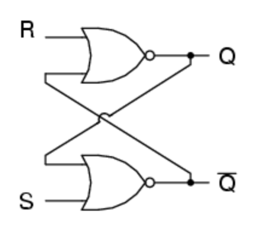
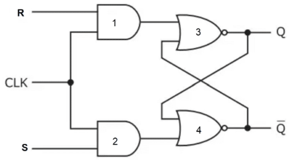

# CDA 3103 Computer Organization & Architecture - Exam 2 Review

    <a href="../textbooks/CDA3103_textbook.pdf">textbook</a> |
    <a href="https://quizlet.com/845007313/cda-3103-exam-2-risc-v-logic-gate-circuits-flash-cards">quizlet</a>

### SI Unit Prefixes 
| Prefix    | Symbol    | Value         |
|-----------|-----------|---------------|
| femto-    | f         | $10^{-15}$    |
| pico-     | p         | $10^{-12}$    |
| nano-     | n         | $10^{-9}$     |
| micro-    | $\mu$     | $10^{-6}$     |
| milli-    | m         | $10^{-3}$     |
| kilo-     | k         | $10^3$        | 
| mega-     | M         | $10^6$        |
| giga-     | G         | $10^9$        |
| tera-     | T         | $10^{12}$     |
| peta-     | P         | $10^{15}$     |

## 1. Logic Gates and Multiplexers

- Boolean expressions can be represented as a diagram of *logic gates*
    - Composed of transistors
    - All except NOT can accept any number of inputs

### Common Logic Gates
| Name  | Symbol                                | Requisite for Signal Output   | Boolean Equivalent            |
|-------|---------------------------------------|-------------------------------|-------------------------------|
| NOT   |   | No input signal               | x', $\bar{x}$                 |
| AND   |   | All input signals             | xy                            |
| OR    |    | Any input signal              | x + y                         |
| XOR   |   | Exactly one input signal      | x $\oplus$ y, x'y + xy'       |
| NAND  |  | Absence of any input signal   | (xy)'                         |
| NOR   |   | No input signals              | (x + y)'                      |
| XNOR  |  | Equal input signals           | (x $\oplus$ y)', x'y' + xy    |

## 2. Combinational Circuits

- *Combinational circuits* comprised of:
    - Basic boolean operations as logic gates
    - Input(s)
    - Output(s)
- Output is function of input
    - Same output given same input

## 3. Sequential Circuits

<!-- TODO refactor -->
These are circuits that hold and use data (typically 1 bit) from their previous inputs to produce their next outputs.

There are multiple types, but all of them are going to be either synchronous or asynchronous. 
- **Synchronous circuits** respond to inputs only when the clock is in a rising state (going from 0 to 1). Most sequential circuits are synchronous.
- **Asynchronous circuits** respond to inputs all the time (they don't have a clock).

### Sequential Circuit Types

#### **Set-Reset Latch**

- Holds one bit of data. It is also the smallest circuit capable doing this.
- Is asynchronous. It doesn't have a clock.
- Can have an undefined state (its data is invalid).

**Circuit:**  

  

**Truth table:**
| S (Set) | R (Reset) | Qt | Q(t+1) |
|:-------:|:---------:|:-----------------:|:-------------------:|
|   0     |     0     |         0         |          0          |
|   0     |     0     |         1         |          1          |
|   0     |     1     |         0         |          0          |
|   0     |     1     |         1         |          0          |
|   1     |     0     |         0         |          1          |
|   1     |     0     |         1         |          1          |
|   1     |     1     |         X         |        Invalid       |

#### Set-Reset Flip-Flop

- Same basic logic as a Set-Reset Latch (see above table and description).
- Only updates when a signal from a clock is received.
- Circuit is the same as a Set-Reset Latch but modified with AND gates to account for the clock.

**Circuit:**

You will more commonly see this as a **block diagram**:

*Click [Here](https://circuitverse.org/users/269149/projects/sr-flip-flop-0b7a0de1-fe11-40df-9094-3a27b6963370) for a working model of this circuit*

#### D Flip-Flop

- A modified SR Flip-Flop in which only one input (SET) is needed.
- Reset is always the opposite of Set.
- The information stored in a D Flip-Flop is only changed when the input changes.
- Subsequent clock pulses do not effect the data stored.

**Circuit:**

**Truth Table:**

| D | Q(t + 1) |
|:-----:|:-----:|
|   0   |   0   |
|   1   |   1   |

*Click [Here](https://circuitverse.org/users/269149/projects/d-flip-flop-40d49df4-0896-410a-bbd5-16acdd8883ae) for a working model of this circuit*

#### JK Flip-Flop

- A modified SR Flip-Flop in which Set and Reset can both be 1.
- Set is denoted with J and Reset is denoted with K.
- When J and K are both 1, Q(t+1) gets set to the complement of Q(t).

**Circuit:**

**Truth Table:**
| J (Set) | K (Reset) | Q(t) | Q(t + 1) |
|:-----:|:-----:|:-----:|:-----:|
|   0   |   0   |   0   |   0   |
|   0   |   0   |   1   |   1   |
|   0   |   1   |   0   |   0   |
|   0   |   1   |   1   |   0   |
|   1   |   0   |   0   |   1   |
|   1   |   0   |   1   |   1   |
|   1   |   1   |   0   |   1   |
|   1   |   1   |   1   |   0   |

*Click [Here](https://circuitverse.org/users/269149/projects/jk-flip-flop-5d11e97f-e706-45b7-9dd6-fba45eb3f167) for a working model of this circuit*

Convert circuit to boolean expression by working backwards from last logic gate (give example with AST)

Additional identities

## 4. RISC-V Assembly

- *RISC-V* is a free and open-source instruction set architecture (ISA)
    - Specification defines

immediate = literal constant

addi - add immediate - dest, op1, op2
    subi - substract immediate

***WIP***