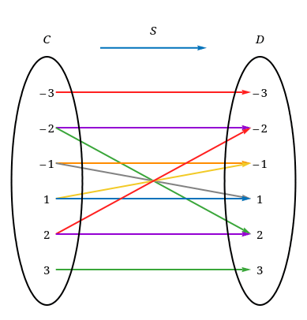
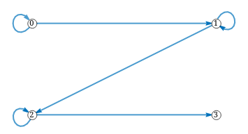

# COT 3100 Discrete Structures - Exam 2 Review

    <a href="../textbooks/COT3100_textbook.pdf">textbook</a> |
    <a href="https://quizlet.com/957758773/cot-3100-set-laws-identities-flash-cards">quizlet</a>

<!-- The following tEx escapes do not render in GFM: \textbf{R}, \textbf{Z}, \empty                         -->
<!-- To render correctly, inline tEx blocks must not have characters directly after them    -->
<!-- There is no way to insert single tilde (~) in GFM tEx                                  -->

## Preliminary - Exam Topics

1. Determine a set resulting from an expression involving multiple sets, then determine the cardinality of the set
2. Determine disjointness among given some sets
3. Identify regions of a Venn diagram corresponding to given set expressions and determine a relationship
4. Determine the complement of a set resulting from a set expression involving intervals of real numbers
5. Determine the result of a union/intersection of an indexed family of sets
6. Determine whether a given collection of sets form a partition of a given set
7. Determine whether some statements concerning sets are generally true or false
8. Given a relation, determine if it's an equivalence relation, possibly determining the number of equivalence classes and class sizes
9. Determine a cardinality involving Cartesian products of sets
10. Determine a cardinality involving an n-ary relation on a given Cartesian product
11. Determine which properties some given relations have
12. Perform repeated squaring, giving the squares and the final result
13. *(Bonus Question)* Mathematical induction
14. *(Bonus Question)* Prove or disprove whether or not a given relation is an equivalence relation

## 1. Set Logic

- The following can be used in place of identities in formal logic
    - "By definition of ..."

### Set Operators & Constants
| Form                  | Name                  | Set-Builder Notation                                                              |
|-----------------------|-----------------------|-----------------------------------------------------------------------------------|
| $A^C$                 | complement            | { x \| x $\notin$ A }                                                             |
| A $\cup$ B            | union                 | { x \| x $\in$ A $\lor$ x $\in$ B }                                               |
| A $\cap$ B            | intersection          | { x \| x $\in$ A $\land$ x $\in$ B }                                              |
| A - B                 | difference            | { x \| x $\in$ A $\land$ x $\notin$ B }                                           |
| A $\times$ B          | cartesian product     | { (x,y) \| x $\in$ A, y $\in$ B }                                                 |
| A $\Delta$ B          | symmetric difference  | { x \| (x $\in$ A $\land$ x $\notin$ B) $\lor$ (x $\in$ B $\land$ x $\notin$ A) } |
| $\emptyset$           | empty set             | { x \| *false* }                                                                  |
| $\textbf{\textbf{U}}$ | universal set         | { x \| *true* }                                                                   |

- Recall order-of-operations for sets is undefined
- Cartesian product can be found using a table

>**Example:** Perform the Cartesian product $\{x,y,z\} \times \{1,2,3\}$.
>
>| *x* \ *y*    | 1     | 2     | 3     |
>|:------------:|:-----:|:-----:|:-----:|
>| x            | (x,1) | (x,2) | (x,3) |
>| y            | (y,1) | (y,2) | (y,3) |
>| z            | (z,1) | (z,2) | (z,3) |
>
> $= \{(x,1), (x,2), \dots, (z,3)\} \checkmark$

### Set Identities
| Name                  | Intersection Form                                         | Union Form                                                         |
|-----------------------|-----------------------------------------------------------|--------------------------------------------------------------------|
| Identity Law          | A $\cap$ $\textbf{U}$ = A                                 | A $\cup$ $\emptyset$ = A                                           |
| Universal Bound Law   | A $\cap$ $\emptyset$ = $\emptyset$                        | A $\cup$ $\textbf{U}$ = $\textbf{U}$                               |
| Idempotent Law        | A $\cap$ A = A                                            | A $\cup$ A = A                                                     |
| Inverse Law           | A $\cap A^C$ = $\emptyset$                                | A $\cup A^C$ = $\textbf{U}$                                        |
| Commutative Law       | A $\cap$ B = B $\cap$ A                                   | A $\cup$ B = B $\cup$ A                                            |
| Associative Law       | (A $\cap$ B) $\cap$ C = A $\cap$ (B $\cap$ C)             | (A $\cup$ B) $\cup$ C = A $\cup$ (B $\cup$ C)                      |
| Distributive Law      | A $\cup$ (B $\cap$ C) = (A $\cup$ B) $\cap$ (A $\cup$ C)  | A $\cap$ (B $\cup$ C) = (A $\cap$ B) $\cup$ (A $\cap$ C)           |
| Absorption Law        | A $\cap$ (A $\cup$ B) = A                                 | A $\cup$ (A $\cap$ B) = A                                          |
| De Morgan's Law       | $(A \cap B)^C$ = $A^C$ $\cup$ $B^C$                       | $(A \cup B)^C$ = $A^C \cap B^C$                                    |

| Name                          | Form                                  |
|-------------------------------|---------------------------------------|
| Double Complement Law         | $(A^C)^C$ = C                         |
| Set Difference Law            | A - B = A $\cup$ $B^C$                |
| Symmetric Difference Law      | A $\Delta$ B = (A - B) $\cup$ (B - A) |
| Reflexive Law                 | A $\subseteq$ A                       |

- To double-check identities, draw a Venn diagram inside of the universal set, $\textbf{U}$
- Sets are *mutually disjoint* if all are disjoint from all others
- 
    - $A \cap B \cap C \cap ... \equiv \emptyset$
- The *cardinality* of a set is its size
    - $|A|=$ # of elements in $A$
- A set can be *partitioned* into multiple sets:
    - That are mutually disjoint
    - Whose union is the original set

>**Example:** List two possible partitions of \( \{1,2,3,4,5\} \).

\[
\{\{1,2\},\{3,5\},\{4\}\}
\]
\[
\{\{2\},\{1\},\{3,4,5\}\}\checkmark$
\]
- Power set, $\mathcal{P}(A)$, is set of all subsets of $A$
    - $\mathcal{P}(\emptyset) = \{ \emptyset \}$
    - $|\mathcal{P}(A)| = 2^{|A|}$

>**Example:** Derive the power set of $\{0,1,2\}$.
>
>$\{\emptyset,\{0\},\{1\},\{2\},\{0,1\},\{0,2\},\{1,2\},\{0,1,2\}\} \checkmark$

### Common Set Identities
| Name                          | Identity                                                          | Alternate Form                                                    |
|-------------------------------|-------------------------------------------------------------------|-------------------------------------------------------------------|
| Definition of union           | A $\cup$ B = { x \| x $\in$ A $\lor$ x $\in$ B }                  | $x \in A \cup B \leftrightarrow x \in A \lor x \in B$             |
| Definition of intersection    | A $\cap$ B = { x \| x $\in$ A $\land$ x $\in$ B }                 | $x \in A \cap B \leftrightarrow x \in A \land x \in B$            |
| Definition of set difference  | A - B = { x \| x $\in$ A $\land$ x $\notin$ B }                   | $x \in A - B \leftrightarrow x \in A \land x \notin B$            |
| Definition of set equality    | $A = B \leftrightarrow A \subseteq B \land B \subseteq A$         |                                                                   |

## 2. Indexed Families of Sets

- An *indexed family of sets* is the application of an operator over all elements in a range
    - Similar to summation notation

TODO practice
TODO how to know # of equivalence classes, codomain elements grouped by?

## 3. Relations over Sets
- A *relation* is a subset of the cartesian product of two sets
    - Each pair of elements satisfies some condition (if true, a *relationship*)
    - First set is domain, second is codomain
- For some relation *R*
    - If x $\in$ A is related to y $\in$ B, expressed as x *R* y $\leftrightarrow$ (x,y) $\in$ R
    - If x is not related to y, expressed as x ~~*R*~~ y $\leftrightarrow$ (x,y) $\notin$ R
    - x *R* y does not necessarily imply y *R* x
- Relation from A to A itself is relation *on* A
    - **Ex:** The operator $<$ is a relation on $\textbf{R}$, a subset of $\textbf{R} \times \textbf{R} = \textbf{R}^2$
- *Divides to* is a relationship that states "$x$ divides $y$ if $y$ is divisible by $x$"
    - Represented as $x | y$ or $\frac{x}{y} \in \textbf{Z}$

### Properties of Relations on a Set
| Property              | Definition                                                                        |
|-----------------------|-----------------------------------------------------------------------------------|
| reflexive             | $\forall a \in A,(a,a) \in R$                                                     |
| symmetric             | $\forall a,b \in A, (a,b) \in R \rightarrow (b,a) \in R$                          |
| transitive            | $\forall a,b,c \in A, ((a,b) \in R \land (b,c) \in R) \rightarrow (a,c) \in R$    |
| equivalence           | <small>*symmetric, reflexive, and transitive*</small>                             |

- The *inverse* of a relation is relation with flipped ordered pairs
    - $R^{-1} = \{ (b,a) | (a,b) \in R \}$
    - Same properties apply
- Symmetric relations are equal to their inverse
- *Arrow diagram* used to represent relations between sets

>**Example:** 
>$C = D = \{−3, −2, −1, 1, 2, 3\}$ 
>$\forall (x, y) \in C \times D,(x, y) \in S \rightarrow \frac{1}{x} − \frac{1}{y} \in \textbf{Z}$ 
> Draw the arrow diagram of the relation $S$.
>
>
>
>$\checkmark$

- *Directed graph* used to represent relation on a set
    - Each domain element connected to its analogous codomain element
    - Set elements not related to any other element appear as unconnected vertices

>**Example:** Draw the directed graph of the relation { (0,0), (0,1), (1,1), (1,2), (2,2), (2,3) } over the set { 0, 1, 2, 3 }.
>
>
>
>$\checkmark$

## 4. Modular Arithmetic

- Rooted in identity $a^m = (a \space mod \space n)^m \space mod \space n$
- Apply identity multiple times through *repeated squaring*

>**Example:** Find ___ through repeated squaring.
>
>
>